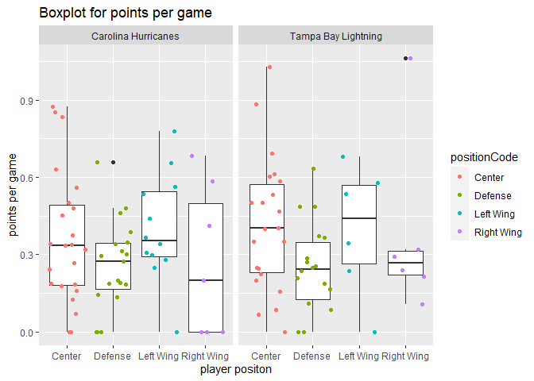

National Hockey League (NHL) Vignette
================
Maggie Feng
June 20, 2021

-   [Functions to read in the data](#functions-to-read-in-the-data)
    -   [NHL records API](#nhl-records-api)
    -   [NHL stats API](#nhl-stats-api)
    -   [API wrapper](#api-wrapper)
-   [Exploratory Data Analysis](#exploratory-data-analysis)
    -   [Contingency tables](#contingency-tables)
    -   [Bar plot](#bar-plot)
    -   [Numerical Summaries](#numerical-summaries)
    -   [Box plot](#box-plot)
    -   [Histogram](#histogram)
        -   [Points per game](#points-per-game)
        -   [Win Percent](#win-percent)
    -   [Scatter plot](#scatter-plot)

Required packages to run this vignette:

``` r
library(httr)
library(jsonlite)
library(xml2)
library(rvest)
library(tidyverse)
library(ggplot2)
library(knitr)
```

# Functions to read in the data

## NHL records API

The `getRecords` function will contact the [NHL records
API](https://gitlab.com/dword4/nhlapi/-/blob/master/records-api.md),
pull data from one of the six endpoints, and output a data frame.

The first argument `input` is to specify one of the six endpoints:

-   `"franchise"` will return id, firstSeasonId, lastSeasonId, and name
    of every team in the history of the NHL
-   `"teamtotal"` will return the total stats for every franchise
-   `"season"` will drill-down into season records and can do so for a
    specific franchise
-   `"goalie"` will return goalie records for all or a specified
    franchise
-   `"skater"` will return skater records for all or a specified
    franchise
-   `"history"` will return admin history (captains, coaches, or general
    managers) or retired numbers

The arguments `name` and `id` are used to specify which team’s records
you wish to output. Adding `name` or `id` for the first two endpoints,
`"franchise"` and `"teamtotal"`, will have the same result of not adding
the arguments at all. For the third, fourth, and fifth endpoint `id`
specification is based on the `franchiseId`, while the sixth endpoint
`id` specification is based on the `mostRecentTeamId`. Due to possible
confusion surrounding the `id` input, if the `name` input is used
alongside it, `name` will override `id` when the function is run.

The final input `detail` is an argument to specify if you want to pull
admin history (captains, coaches, or managers) or retired numbers.
Adding this argument will not affect the first five endpoints, but is
required when the `input` is `"history"`.

The `detail` argument can be:

-   `"captain"` to give the captain history
-   `"coach"` to give the coach history
-   `"manager"` to give the general manager history
-   `"player"` to give the retired numbers

``` r
#Function to contact the NHL records API
getRecords <- function(input = c("franchise", "teamtotal", "season", "goalie", "skater", "history"), 
                       name = NULL, id = NULL, detail = NULL){
  ##Note: if both team name and id arguments are filled, team name overrides id number
  
  #All queries are prefixed by this base_url
  base_url <- "https://records.nhl.com/site/api"
  
  #Function to convert the url
  convert <- function(url){
    x <- GET(url)                #Retrieving data from URL
    y <- content(x, as = "text") #Converiting it to JSON text
    fromJSON(y)                  #Converting to list
  }
  
  #First two endpoints: do not have name/id specification
  if (input == "franchise" | input == "teamtotal"){
    if (input == "franchise")
      endpoint <- "franchise"
    if (input == "teamtotal")
      endpoint <- "franchise-team-totals"
    full_url <- paste0(base_url, "/", endpoint)
    z <- convert(full_url)
    #Returns well-formatted, parsed data
    out <-as.data.frame(z$data)  #Converting to data frame
  }
  
  #Third, fourth, and fifth endpoints: with name/id specification by franchiseId
  if (input == "season" | input == "goalie" | input == "skater"){
    if (input == "season")
      endpoint <- "franchise-season-records"
    if (input == "goalie")
      endpoint <- "franchise-goalie-records"
    if (input == "skater")
      endpoint <- "franchise-skater-records"
    
    if (is.null(name) & is.null(id)){
      full_url <- paste0(base_url,"/", endpoint)
    }
    else {
      if (!is.null(id)) {
        full_url <- paste0(base_url,"/", endpoint, "?cayenneExp=franchiseId=", id)
      }
      if (!is.null(name)) {
        #Names based on franchiseId
        v <- c("Montreal Canadiens", "Montreal Wanderers", "St. Louis Eagles", "Hamilton Tigers",
               "Toronto Maple Leafs", "Boston Bruins", "Montreal Maroons", "Brooklyn Americans",
               "Philadelphia Quakers", "New York Rangers", "Chicago Blackhawks", "Detroit Red Wings",
               "Cleveland Barons", "Los Angeles Kings", "Dallas Stars", "Philadelphia Flyers", 
               "Pittsburgh Penguins", "St. Louis Blues", "Buffalo Sabres", "Vancouver Canucks", 
               "Calgary Flames", "New York Islanders", "New Jersey Devils", "Washington Capitals",
               "Edmonton Oilers", "Carolina Hurricanes", "Colorado Avalanche", "Arizona Coyotes",
               "San Jose Sharks", "Ottawa Senators", "Tampa Bay Lightning", "Anaheim Ducks",
               "Florida Panthers", "Nashville Predators", "Winnipeg Jets", "Columbus Blue Jackets",
               "Minnesota Wild", "Vegas Golden Knights", "Seattle Kraken")
        #Gives the number corresponding the position of the team name in vector v
        nameid <- match(name, v)
        full_url <- paste0(base_url,"/", endpoint,"?cayenneExp=franchiseId=", nameid)
      }
    }
    z <- convert(full_url)
    #Returns well-formatted, parsed data
    out <-as.data.frame(z$data)  #Converting to data frame
  }
  
  #Sixth endpoint: has name/id specification by mostRecentTeamId instead of franchiseId
  if (input == "history"){
    endpoint <- "franchise-detail"
    if (is.null(name) & is.null(id)){
      stop("Need to specify team")
    }
    else {
      if (!is.null(id)) {
        full_url <- paste0(base_url, "/", endpoint, "?cayenneExp=mostRecentTeamId=", id)
      }
      if (!is.null(name)) {
        #Names based on order of mostRecentTeamId
        u <- c("New Jersey Devils", "New York Islanders", "New York Rangers", "Philadelphia Flyers",
               "Pittsburgh Penguins", "Boston Bruins", "Buffalo Sabres", "Montreal Canadiens",
               "Ottawa Senators", "Toronto Maple Leafs", "Carolina Hurricanes", "Florida Panthers",
               "Tampa Bay Lightning", "Washington Capitals", "Chicago Blackhawks", 
               "Detroit Red Wings", "Nashville Predators", "St. Louis Blues", "Calgary Flames", 
               "Colorado Avalanche", "Edmonton Oilers", "Vancouver Canucks", "Anaheim Ducks", 
               "Dallas Stars","Los Angeles Kings", "San Jose Sharks", "Columbus Blue Jackets", 
               "Minnesota Wild", "Hamilton Tigers", "Philadelphia Quakers", "Montreal Wanderers",
               "Montreal Maroons","St. Louis Eagles", "Cleveland Barons", "Brooklyn Americans",
               "Winnipeg Jets", "Arizona Coyotes", "Vegas Golden Knights", "Seattle Kraken")
        #Gives the number corresponding the position of the team name in vector v
        nameid <- match(name, u)
        #Numbers corresponding to mostRecentTeamId for teams in vector u
        unum <- c(1:10, 12:30, seq(37,45,by=2), 49, 51:55)
        full_url <- paste0(base_url,"/", endpoint, "?cayenneExp=mostRecentTeamId=", unum[nameid])
      }
    }
    z <- convert(full_url)
    #Converting to data frame
    a <- as.data.frame(z$data)
    
    #Output error if detail is not given for "history" input
    if (is.null(detail)){
      stop("Need to specify detail: captain, coach, manager, or player")
    }
    
    #Selecting which detail you want
    if (detail == "captain")
      b <- a$captainHistory
    if (detail == "coach")
      b <- a$coachingHistory
    if (detail == "manager")
      b <- a$generalManagerHistory
    if (detail == "player")
      b <- a$retiredNumbersSummary
    #Converting to strings
    info <- read_html(b) %>%
      html_nodes(css = "li") %>%
      html_text() 
    out <- as.data.frame(info)
  }
  out
}
```

Below are some examples of how to use the function. The first outputs
all of the franchise information. The second shows how adding an `id`
(or `name`) argument will not affect the `"teamtotal"` (and
`"franchise"`) endpoint(s). The third shows season records for the team
with 1 as the`id`, which, in this case is the `franchiseId`. The fourth
shows season records for all teams since the `name` and `id` were not
specified. The fifth shows goalie information for the team with the
`name` Carolina Hurricanes. The sixth shows how the `name` input
overrides the `id` input, giving us the skater inforamtion for the team
with `name` Carolina Hurricanes. The seventh shows the retired numbers
for the team with 1 as the `id`, which is the `mostRecentTeamId`. It
pulls the information on the retired numbers due to the `detail`
argument.

``` r
## Examples:
#Franchise information
franchise <- getRecords("franchise")
head(franchise)
```

    ##   id firstSeasonId            fullName lastSeasonId mostRecentTeamId teamAbbrev teamCommonName
    ## 1  1      19171918  Montréal Canadiens           NA                8        MTL      Canadiens
    ## 2  2      19171918  Montreal Wanderers     19171918               41        MWN      Wanderers
    ## 3  3      19171918    St. Louis Eagles     19341935               45        SLE         Eagles
    ## 4  4      19191920     Hamilton Tigers     19241925               37        HAM         Tigers
    ## 5  5      19171918 Toronto Maple Leafs           NA               10        TOR    Maple Leafs
    ## 6  6      19241925       Boston Bruins           NA                6        BOS         Bruins
    ##   teamPlaceName
    ## 1      Montréal
    ## 2      Montreal
    ## 3     St. Louis
    ## 4      Hamilton
    ## 5       Toronto
    ## 6        Boston

``` r
#Total stats for every franchise
total <- getRecords("teamtotal", id=1)
head(total)
```

    ##   id activeFranchise firstSeasonId franchiseId gameTypeId gamesPlayed goalsAgainst goalsFor homeLosses
    ## 1  1               1      19821983          23          2        2993         8902     8792        525
    ## 2  2               1      19821983          23          3         257          634      697         53
    ## 3  3               1      19721973          22          2        3788        11907    12045        678
    ## 4  4               1      19721973          22          3         310          899      986         53
    ## 5  5               1      19261927          10          2        6560        20020    20041       1143
    ## 6  6               1      19261927          10          3         518         1447     1404        104
    ##   homeOvertimeLosses homeTies homeWins lastSeasonId losses overtimeLosses penaltyMinutes pointPctg points
    ## 1                 85       96      790           NA   1211            169          44773    0.5306   3176
    ## 2                  0       NA       74           NA    120              0           4266    0.0039      2
    ## 3                 84      170      963           NA   1587            166          57792    0.5133   3889
    ## 4                  1       NA       95           NA    139              0           5693    0.0129      8
    ## 5                 76      448     1614           NA   2716            153          86129    0.5127   6727
    ## 6                  0        1      137           NA    266              0           8181    0.0000      0
    ##   roadLosses roadOvertimeLosses roadTies roadWins shootoutLosses shootoutWins shutouts teamId
    ## 1        686                 84      123      604             84           78      196      1
    ## 2         67                  0       NA       63              0            0       25      1
    ## 3        909                 82      177      725             70           86      177      2
    ## 4         86                  2       NA       76              0            0       12      2
    ## 5       1573                 77      360     1269             68           79      408      3
    ## 6        162                  0        7      107              0            0       44      3
    ##             teamName ties triCode wins
    ## 1  New Jersey Devils  219     NJD 1394
    ## 2  New Jersey Devils   NA     NJD  137
    ## 3 New York Islanders  347     NYI 1688
    ## 4 New York Islanders   NA     NYI  171
    ## 5   New York Rangers  808     NYR 2883
    ## 6   New York Rangers    8     NYR  244

``` r
#Season records for specific franchise or for all 
season <- getRecords("season", id=1)
head(season)
```

    ##   id fewestGoals fewestGoalsAgainst fewestGoalsAgainstSeasons fewestGoalsSeasons fewestLosses
    ## 1  8         155                131              1955-56 (70)       1952-53 (70)            8
    ##   fewestLossesSeasons fewestPoints fewestPointsSeasons fewestTies fewestTiesSeasons fewestWins
    ## 1        1976-77 (80)           65        1950-51 (70)          5      1983-84 (80)         25
    ##   fewestWinsSeasons franchiseId      franchiseName homeLossStreak
    ## 1      1950-51 (70)           1 Montréal Canadiens              7
    ##                                    homeLossStreakDates homePointStreak      homePointStreakDates
    ## 1 Dec 16 1939 - Jan 18 1940, Oct 28 2000 - Nov 25 2000              34 Nov 01 1976 - Apr 02 1977
    ##   homeWinStreak                                   homeWinStreakDates homeWinlessStreak
    ## 1            13 Nov 02 1943 - Jan 08 1944, Jan 30 1977 - Mar 26 1977                15
    ##      homeWinlessStreakDates lossStreak           lossStreakDates mostGameGoals           mostGameGoalsDates
    ## 1 Dec 16 1939 - Mar 07 1940         12 Feb 13 1926 - Mar 13 1926            16 Mar 03 1920 - MTL 16 @ QBD 3
    ##   mostGoals mostGoalsAgainst mostGoalsAgainstSeasons mostGoalsSeasons mostLosses
    ## 1       387              295            1983-84 (80)     1976-77 (80)         40
    ##                          mostLossesSeasons mostPenaltyMinutes mostPenaltyMinutesSeasons mostPoints
    ## 1 1983-84 (80), 2000-01 (82), 2017-18 (82)               1847              1995-96 (82)        132
    ##   mostPointsSeasons mostShutouts mostShutoutsSeasons mostTies mostTiesSeasons mostWins mostWinsSeasons
    ## 1      1976-77 (80)           22        1928-29 (44)       23    1962-63 (70)       60    1976-77 (80)
    ##   pointStreak          pointStreakDates roadLossStreak       roadLossStreakDates roadPointStreak
    ## 1          28 Dec 18 1977 - Feb 23 1978             10 Jan 16 1926 - Mar 13 1926              23
    ##        roadPointStreakDates roadWinStreak                                   roadWinStreakDates
    ## 1 Nov 27 1974 - Mar 12 1975             8 Dec 18 1977 - Jan 18 1978, Jan 21 1982 - Feb 21 1982
    ##   roadWinlessStreak                               roadWinlessStreakDates winStreak
    ## 1                12 Nov 26 1933 - Jan 28 1934, Oct 20 1951 - Dec 13 1951        12
    ##              winStreakDates winlessStreak                                   winlessStreakDates
    ## 1 Jan 06 1968 - Feb 03 1968            12 Feb 13 1926 - Mar 13 1926, Nov 28 1935 - Dec 29 1935

``` r
allseason <- getRecords("season")
head(allseason)
```

    ##   id fewestGoals fewestGoalsAgainst fewestGoalsAgainstSeasons fewestGoalsSeasons fewestLosses
    ## 1  1         174                164              2003-04 (82)       2010-11 (82)           19
    ## 2  2         170                190              1975-76 (80)       1972-73 (78)           15
    ## 3  3         150                177              1970-71 (78)       1954-55 (70)           17
    ## 4  4         173                164              1973-74 (78)       1967-68 (74)           12
    ## 5  5         182                188              1997-98 (82)       1969-70 (76)           21
    ## 6  6         147                172              1952-53 (70)       1955-56 (70)           13
    ##          fewestLossesSeasons fewestPoints fewestPointsSeasons fewestTies fewestTiesSeasons fewestWins
    ## 1               2000-01 (82)           36        1975-76 (80)          3      1985-86 (80)         12
    ## 2               1978-79 (80)           30        1972-73 (78)          4      1983-84 (80)         12
    ## 3               1971-72 (78)           47        1965-66 (70)          4      2001-02 (82)         17
    ## 4               1979-80 (80)           56        2006-07 (82)          4      1985-86 (80)         17
    ## 5 1992-93 (84), 2016-17 (82)           38        1983-84 (80)          4      1995-96 (82)         16
    ## 6               1971-72 (78)           38        1961-62 (70)          5      1972-73 (78)         14
    ##                          fewestWinsSeasons franchiseId       franchiseName homeLossStreak
    ## 1                             1975-76 (80)          23   New Jersey Devils             10
    ## 2                             1972-73 (78)          22  New York Islanders              7
    ## 3 1952-53 (70), 1954-55 (70), 1959-60 (70)          10    New York Rangers              7
    ## 4                             1969-70 (76)          16 Philadelphia Flyers              8
    ## 5                             1983-84 (80)          17 Pittsburgh Penguins             14
    ## 6                             1962-63 (70)           6       Boston Bruins             11
    ##                                    homeLossStreakDates homePointStreak
    ## 1                            Jan 26 2021 - Mar 13 2021              15
    ## 2 Nov 13 1999 - Dec 14 1999, Feb 27 2001 - Mar 29 2001              23
    ## 3 Oct 20 1976 - Nov 14 1976, Mar 24 1993 - Apr 14 1993              24
    ## 4                            Dec 09 2006 - Jan 27 2007              26
    ## 5                            Dec 31 2003 - Feb 22 2004              20
    ## 6                            Dec 08 1924 - Feb 17 1925              27
    ##                                   homePointStreakDates homeWinStreak        homeWinStreakDates
    ## 1 Jan 08 1997 - Mar 15 1997, Dec 14 1999 - Feb 17 2000            11 Feb 09 2009 - Mar 20 2009
    ## 2 Oct 17 1978 - Jan 20 1979, Jan 02 1982 - Apr 03 1982            14 Jan 02 1982 - Feb 25 1982
    ## 3 Oct 14 1970 - Jan 31 1971, Oct 24 1995 - Feb 15 1996            14 Dec 19 1939 - Feb 25 1940
    ## 4                            Oct 11 1979 - Feb 03 1980            20 Jan 04 1976 - Apr 03 1976
    ## 5                            Nov 30 1974 - Feb 22 1975            13 Nov 15 2013 - Jan 15 2014
    ## 6                            Nov 22 1970 - Mar 20 1971            20 Dec 03 1929 - Mar 18 1930
    ##   homeWinlessStreak                               homeWinlessStreakDates lossStreak
    ## 1                14 Feb 12 1976 - Mar 30 1976, Feb 04 1979 - Mar 31 1979         14
    ## 2                 9                            Mar 02 1999 - Apr 06 1999         12
    ## 3                10                            Jan 30 1944 - Mar 19 1944         11
    ## 4                13                            Nov 29 2006 - Feb 08 2007          9
    ## 5                16                            Dec 31 2003 - Mar 04 2004         13
    ## 6                11                            Dec 08 1924 - Feb 17 1925         11
    ##                                        lossStreakDates mostGameGoals
    ## 1                            Dec 30 1975 - Jan 29 1976             9
    ## 2 Dec 27 1972 - Jan 16 1973, Nov 22 1988 - Dec 15 1988            11
    ## 3                            Oct 30 1943 - Nov 27 1943            12
    ## 4                            Dec 08 2006 - Dec 27 2006            13
    ## 5                            Jan 13 2004 - Feb 12 2004            12
    ## 6                            Dec 03 1924 - Jan 05 1925            14
    ##                                                                                                                                                                                                                                                    mostGameGoalsDates
    ## 1 Apr 01 1979 - STL 5 @ CLR 9, Feb 12 1982 - QUE 2 @ CLR 9, Apr 06 1986 - NYI 7 @ NJD 9, Mar 10 1990 - QUE 3 @ NJD 9, Dec 05 1990 - VAN 4 @ NJD 9, Oct 26 1991 - SJS 0 @ NJD 9, Mar 23 1993 - TBL 3 @ NJD 9, Mar 10 2000 - NJD 9 @ ATL 0, Oct 28 2000 - NJD 9 @ PIT 0
    ## 2                                                                                                                                                                                                          Dec 20 1983 - PIT 3 @ NYI 11, Mar 03 1984 - NYI 11 @ TOR 6
    ## 3                                                                                                                                                                                                                                        Nov 21 1971 - CGS 1 @ NYR 12
    ## 4                                                                                                                                                                                                          Mar 22 1984 - PIT 4 @ PHI 13, Oct 18 1984 - VAN 2 @ PHI 13
    ## 5                                                                                                                                                                                                          Mar 15 1975 - WSH 1 @ PIT 12, Dec 26 1991 - TOR 1 @ PIT 12
    ## 6                                                                                                                                                                                                                                        Jan 21 1945 - NYR 3 @ BOS 14
    ##   mostGoals mostGoalsAgainst mostGoalsAgainstSeasons mostGoalsSeasons mostLosses          mostLossesSeasons
    ## 1       308              374            1985-86 (80)     1992-93 (84)         56 1975-76 (80), 1983-84 (80)
    ## 2       385              347            1972-73 (78)     1981-82 (80)         60               1972-73 (78)
    ## 3       321              345            1984-85 (80)     1991-92 (80)         44               1984-85 (80)
    ## 4       350              319            1992-93 (84)     1983-84 (80)         48               2006-07 (82)
    ## 5       367              394            1982-83 (80)     1992-93 (84)         58               1983-84 (80)
    ## 6       399              306            1961-62 (70)     1970-71 (78)         47 1961-62 (70), 1996-97 (82)
    ##   mostPenaltyMinutes mostPenaltyMinutesSeasons mostPoints mostPointsSeasons mostShutouts
    ## 1               2494              1988-89 (80)        111      2000-01 (82)           14
    ## 2               1857              1986-87 (80)        118      1981-82 (80)           11
    ## 3               2021              1989-90 (80)        113      2014-15 (82)           13
    ## 4               2621              1980-81 (80)        118      1975-76 (80)           13
    ## 5               2674              1988-89 (80)        119      1992-93 (84)           10
    ## 6               2443              1987-88 (80)        121      1970-71 (78)           15
    ##   mostShutoutsSeasons mostTies mostTiesSeasons mostWins            mostWinsSeasons pointStreak
    ## 1        2003-04 (82)       21    1977-78 (80)       51               2008-09 (82)          16
    ## 2        2018-19 (82)       22    1974-75 (80)       54               1981-82 (80)          17
    ## 3        1928-29 (44)       21    1950-51 (70)       53               2014-15 (82)          19
    ## 4        1974-75 (80)       24    1969-70 (76)       53 1984-85 (80), 1985-86 (80)          35
    ## 5        2014-15 (82)       20    1970-71 (78)       56               1992-93 (84)          18
    ## 6        1927-28 (44)       21    1954-55 (70)       57               1970-71 (78)          23
    ##            pointStreakDates roadLossStreak                                  roadLossStreakDates
    ## 1 Dec 26 1999 - Jan 28 2000             12                            Oct 19 1983 - Dec 01 1983
    ## 2 Oct 12 2019 - Nov 23 2019             15                            Jan 20 1973 - Mar 31 1973
    ## 3 Nov 23 1939 - Jan 13 1940             10 Oct 30 1943 - Dec 23 1943, Feb 08 1961 - Mar 15 1961
    ## 4 Oct 14 1979 - Jan 06 1980              8 Oct 25 1972 - Nov 26 1972, Mar 03 1988 - Mar 29 1988
    ## 5 Mar 09 1993 - Apr 14 1993             18                            Dec 23 1982 - Mar 04 1983
    ## 6 Dec 22 1940 - Feb 23 1941             14                            Dec 27 1964 - Feb 21 1965
    ##   roadPointStreak
    ## 1              10
    ## 2               8
    ## 3              11
    ## 4              16
    ## 5               8
    ## 6              16
    ##                                                                                         roadPointStreakDates
    ## 1                                                       Feb 27 2001 - Apr 07 2001, Jan 30 2007 - Mar 15 2007
    ## 2 Feb 12 1976 - Mar 14 1976, Nov 12 1978 - Dec 09 1978, Feb 27 1981 - Mar 29 1981, Oct 07 1981 - Nov 11 1981
    ## 3                                                                                  Nov 05 1939 - Jan 13 1940
    ## 4                                                                                  Oct 20 1979 - Jan 06 1980
    ## 5                                                       Jan 13 2007 - Feb 16 2007, Mar 11 2016 - Apr 07 2016
    ## 6                                                                                  Jan 11 2014 - Mar 30 2014
    ##   roadWinStreak        roadWinStreakDates roadWinlessStreak
    ## 1            10 Feb 27 2001 - Apr 07 2001                32
    ## 2             8 Feb 27 1981 - Mar 29 1981                20
    ## 3             9 Jan 16 2020 - Feb 27 2020                16
    ## 4             8 Dec 22 1982 - Jan 16 1983                19
    ## 5             8 Mar 11 2016 - Apr 07 2016                18
    ## 6             9 Mar 02 2014 - Mar 30 2014                14
    ##                                                            roadWinlessStreakDates winStreak
    ## 1                                                       Nov 12 1977 - Mar 15 1978        13
    ## 2                                                       Nov 03 1972 - Jan 13 1973        15
    ## 3                                                       Oct 09 1952 - Dec 20 1952        10
    ## 4                                                       Oct 23 1971 - Jan 27 1972        13
    ## 5                            Oct 25 1970 - Jan 14 1971, Dec 23 1982 - Mar 04 1983        17
    ## 6 Oct 12 1963 - Dec 14 1963, Dec 27 1964 - Feb 21 1965, Nov 09 1966 - Jan 07 1967        14
    ##                                         winStreakDates winlessStreak
    ## 1                            Feb 26 2001 - Mar 23 2001            27
    ## 2                            Jan 21 1982 - Feb 20 1982            15
    ## 3 Dec 19 1939 - Jan 13 1940, Jan 19 1973 - Feb 10 1973            21
    ## 4                            Oct 19 1985 - Nov 17 1985            12
    ## 5                            Mar 09 1993 - Apr 10 1993            18
    ## 6                            Dec 03 1929 - Jan 09 1930            20
    ##                                     winlessStreakDates
    ## 1                            Feb 12 1976 - Apr 04 1976
    ## 2                            Nov 22 1972 - Dec 21 1972
    ## 3                            Jan 23 1944 - Mar 19 1944
    ## 4                            Feb 24 1999 - Mar 16 1999
    ## 5 Jan 02 1983 - Feb 10 1983, Jan 13 2004 - Feb 22 2004
    ## 6                            Jan 28 1962 - Mar 11 1962

``` r
#Goalie records for specific franchise
goalie <- getRecords("goalie", name = "Carolina Hurricanes")
head(goalie)
```

    ##    id activePlayer firstName franchiseId       franchiseName gameTypeId gamesPlayed    lastName losses
    ## 1 336        FALSE       Tom          26 Carolina Hurricanes          2          34    Barrasso     12
    ## 2 363        FALSE   Richard          26 Carolina Hurricanes          2           6     Brodeur      2
    ## 3 369        FALSE      Sean          26 Carolina Hurricanes          2         256       Burke    120
    ## 4 411        FALSE      Mark          26 Carolina Hurricanes          2           3 Fitzpatrick      2
    ## 5 425        FALSE      John          26 Carolina Hurricanes          2         122     Garrett     57
    ## 6 430        FALSE     Mario          26 Carolina Hurricanes          2          23    Gosselin     13
    ##                            mostGoalsAgainstDates mostGoalsAgainstOneGame mostSavesDates mostSavesOneGame
    ## 1             2001-12-30, 2001-12-18, 2001-11-29                       5     2001-12-10               40
    ## 2                                     1988-03-09                       4     1988-04-03               31
    ## 3                                     1992-12-11                       9     1994-01-01               51
    ## 4                                     2000-02-15                       5     2000-02-15               40
    ## 5 1982-01-02, 1980-10-11, 1980-03-08, 1980-02-26                       9     1981-02-14               50
    ## 6                         1993-04-10, 1993-03-24                       6     1993-03-22               45
    ##    mostShotsAgainstDates mostShotsAgainstOneGame mostShutoutsOneSeason        mostShutoutsSeasonIds
    ## 1             2001-12-10                      43                     2                     20012002
    ## 2             1988-04-03                      34                     0                     19871988
    ## 3 1996-01-27, 1994-01-01                      54                     4           19951996, 19961997
    ## 4             2000-02-15                      45                     0                     19992000
    ## 5             1981-02-14                      57                     0 19791980, 19801981, 19811982
    ## 6             1993-03-22                      50                     0           19921993, 19931994
    ##   mostWinsOneSeason mostWinsSeasonIds overtimeLosses playerId positionCode rookieGamesPlayed rookieShutouts
    ## 1                13          20012002             NA  8445275            G                NA             NA
    ## 2                 4          19871988             NA  8445694            G                NA             NA
    ## 3                28          19951996             NA  8445769            G                NA             NA
    ## 4                 0          19992000             NA  8446829            G                NA             NA
    ## 5                16          19791980             NA  8447066            G                NA             NA
    ## 6                 5          19921993             NA  8447303            G                NA             NA
    ##   rookieWins seasons shutouts ties wins
    ## 1         NA       1        2    5   13
    ## 2         NA       1        0    0    4
    ## 3         NA       6       10   24  100
    ## 4         NA       1        0    0    0
    ## 5         NA       3        0   27   36
    ## 6         NA       2        0    1    5

``` r
#Skater records for for specific franchise
skater <- getRecords("skater", name = "Carolina Hurricanes", id=1)
head(skater)
```

    ##      id activePlayer assists firstName franchiseId       franchiseName gameTypeId gamesPlayed goals
    ## 1 17239        FALSE       0       Jim          26 Carolina Hurricanes          2          16     0
    ## 2 17418        FALSE       1      Mike          26 Carolina Hurricanes          2           5     0
    ## 3 17543        FALSE       0      Fred          26 Carolina Hurricanes          2           3     0
    ## 4 17703        FALSE       2    Jergus          26 Carolina Hurricanes          2          10     0
    ## 5 17728        FALSE       0      Reid          26 Carolina Hurricanes          2          12     0
    ## 6 18169        FALSE       0       Bob          26 Carolina Hurricanes          2           1     0
    ##     lastName
    ## 1      Agnew
    ## 2 Antonovich
    ## 3     Arthur
    ## 4       Baca
    ## 5     Bailey
    ## 6      Bodak
    ##                                                                                                                                                                                                                                                                                                                                                                                                                                                                                                                                                                                                                                                                                                                                                                                                                                                                                                                                                                                                                             mostAssistsGameDates
    ## 1 1992-10-06, 1992-10-08, 1992-10-10, 1992-10-12, 1992-10-14, 1992-10-17, 1992-10-20, 1992-10-22, 1992-10-24, 1992-10-28, 1992-10-31, 1992-11-03, 1992-11-06, 1992-11-07, 1992-11-11, 1992-11-13, 1992-11-14, 1992-11-18, 1992-11-19, 1992-11-21, 1992-11-25, 1992-11-27, 1992-11-28, 1992-12-01, 1992-12-03, 1992-12-05, 1992-12-09, 1992-12-11, 1992-12-12, 1992-12-16, 1992-12-18, 1992-12-19, 1992-12-21, 1992-12-23, 1992-12-26, 1992-12-27, 1992-12-31, 1993-01-02, 1993-01-03, 1993-01-06, 1993-01-09, 1993-01-10, 1993-01-13, 1993-01-15, 1993-01-16, 1993-01-18, 1993-01-21, 1993-01-23, 1993-01-24, 1993-01-27, 1993-01-28, 1993-01-30, 1993-02-03, 1993-02-08, 1993-02-12, 1993-02-13, 1993-02-17, 1993-02-20, 1993-02-21, 1993-02-24, 1993-02-27, 1993-02-28, 1993-03-03, 1993-03-05, 1993-03-06, 1993-03-08, 1993-03-10, 1993-03-13, 1993-03-16, 1993-03-19, 1993-03-22, 1993-03-24, 1993-03-27, 1993-03-28, 1993-03-30, 1993-04-01, 1993-04-03, 1993-04-05, 1993-04-07, 1993-04-10, 1993-04-11, 1993-04-13, 1993-04-14, 1993-04-16
    ## 2                                                                                                                                                                                                                                                                                                                                                                                                                                                                                                                                                                                                                                                                                                                                                                                                                                                                                                                                                                                                                                     1979-10-13
    ## 3                                                 1980-10-09, 1980-10-11, 1980-10-12, 1980-10-15, 1980-10-18, 1980-10-19, 1980-10-22, 1980-10-25, 1980-10-26, 1980-10-29, 1980-10-30, 1980-11-01, 1980-11-05, 1980-11-06, 1980-11-08, 1980-11-12, 1980-11-15, 1980-11-16, 1980-11-20, 1980-11-22, 1980-11-23, 1980-11-26, 1980-11-28, 1980-11-29, 1980-12-02, 1980-12-03, 1980-12-06, 1980-12-07, 1980-12-10, 1980-12-13, 1980-12-17, 1980-12-20, 1980-12-21, 1980-12-23, 1980-12-26, 1980-12-27, 1981-01-02, 1981-01-03, 1981-01-07, 1981-01-09, 1981-01-10, 1981-01-12, 1981-01-14, 1981-01-17, 1981-01-18, 1981-01-21, 1981-01-23, 1981-01-24, 1981-01-28, 1981-01-30, 1981-01-31, 1981-02-02, 1981-02-04, 1981-02-07, 1981-02-08, 1981-02-12, 1981-02-14, 1981-02-15, 1981-02-18, 1981-02-19, 1981-02-22, 1981-02-25, 1981-02-27, 1981-03-01, 1981-03-03, 1981-03-06, 1981-03-08, 1981-03-10, 1981-03-11, 1981-03-14, 1981-03-15, 1981-03-18, 1981-03-21, 1981-03-22, 1981-03-25, 1981-03-27, 1981-03-29, 1981-04-01, 1981-04-03, 1981-04-05
    ## 4                                                                                                                                                                                                                                                                                                                                                                                                                                                                                                                                                                                                                                                                                                                                                                                                                                                                                                                                                                                                                         1990-10-27, 1991-02-24
    ## 5                                                 1983-10-05, 1983-10-08, 1983-10-09, 1983-10-13, 1983-10-15, 1983-10-19, 1983-10-22, 1983-10-25, 1983-10-28, 1983-10-30, 1983-11-01, 1983-11-02, 1983-11-05, 1983-11-06, 1983-11-08, 1983-11-12, 1983-11-15, 1983-11-17, 1983-11-19, 1983-11-23, 1983-11-26, 1983-11-30, 1983-12-03, 1983-12-04, 1983-12-06, 1983-12-08, 1983-12-10, 1983-12-13, 1983-12-15, 1983-12-17, 1983-12-20, 1983-12-21, 1983-12-23, 1983-12-26, 1983-12-27, 1983-12-30, 1984-01-03, 1984-01-05, 1984-01-07, 1984-01-08, 1984-01-10, 1984-01-13, 1984-01-15, 1984-01-17, 1984-01-19, 1984-01-21, 1984-01-24, 1984-01-26, 1984-01-28, 1984-01-29, 1984-02-01, 1984-02-04, 1984-02-05, 1984-02-07, 1984-02-11, 1984-02-12, 1984-02-14, 1984-02-16, 1984-02-18, 1984-02-19, 1984-02-23, 1984-02-25, 1984-02-26, 1984-03-03, 1984-03-04, 1984-03-07, 1984-03-08, 1984-03-11, 1984-03-13, 1984-03-15, 1984-03-17, 1984-03-18, 1984-03-20, 1984-03-21, 1984-03-24, 1984-03-25, 1984-03-27, 1984-03-29, 1984-03-31, 1984-04-01
    ## 6                                                                                                                                                                                                                                                                                                                                                                                                                                                 1989-12-14, 1989-12-16, 1989-12-19, 1989-12-20, 1989-12-23, 1989-12-26, 1989-12-30, 1990-01-03, 1990-01-05, 1990-01-06, 1990-01-10, 1990-01-13, 1990-01-15, 1990-01-17, 1990-01-19, 1990-01-23, 1990-01-25, 1990-01-27, 1990-01-30, 1990-02-01, 1990-02-03, 1990-02-04, 1990-02-07, 1990-02-09, 1990-02-10, 1990-02-14, 1990-02-17, 1990-02-18, 1990-02-21, 1990-02-23, 1990-02-24, 1990-02-28, 1990-03-02, 1990-03-03, 1990-03-06, 1990-03-08, 1990-03-10, 1990-03-11, 1990-03-13, 1990-03-17, 1990-03-18, 1990-03-21, 1990-03-24, 1990-03-25, 1990-03-27, 1990-03-29, 1990-03-31, 1990-04-01
    ##   mostAssistsOneGame mostAssistsOneSeason mostAssistsSeasonIds
    ## 1                  0                    0             19921993
    ## 2                  1                    1             19791980
    ## 3                  0                    0             19801981
    ## 4                  1                    2             19901991
    ## 5                  0                    0             19831984
    ## 6                  0                    0             19891990
    ##                                                                                                                                                                                                                                                                                                                                                                                                                                                                                                                                                                                                                                                                                                                                                                                                                                                                                                                                                                                                                                                                                                                                                                   mostGoalsGameDates
    ## 1                                                                                                                                     1992-10-06, 1992-10-08, 1992-10-10, 1992-10-12, 1992-10-14, 1992-10-17, 1992-10-20, 1992-10-22, 1992-10-24, 1992-10-28, 1992-10-31, 1992-11-03, 1992-11-06, 1992-11-07, 1992-11-11, 1992-11-13, 1992-11-14, 1992-11-18, 1992-11-19, 1992-11-21, 1992-11-25, 1992-11-27, 1992-11-28, 1992-12-01, 1992-12-03, 1992-12-05, 1992-12-09, 1992-12-11, 1992-12-12, 1992-12-16, 1992-12-18, 1992-12-19, 1992-12-21, 1992-12-23, 1992-12-26, 1992-12-27, 1992-12-31, 1993-01-02, 1993-01-03, 1993-01-06, 1993-01-09, 1993-01-10, 1993-01-13, 1993-01-15, 1993-01-16, 1993-01-18, 1993-01-21, 1993-01-23, 1993-01-24, 1993-01-27, 1993-01-28, 1993-01-30, 1993-02-03, 1993-02-08, 1993-02-12, 1993-02-13, 1993-02-17, 1993-02-20, 1993-02-21, 1993-02-24, 1993-02-27, 1993-02-28, 1993-03-03, 1993-03-05, 1993-03-06, 1993-03-08, 1993-03-10, 1993-03-13, 1993-03-16, 1993-03-19, 1993-03-22, 1993-03-24, 1993-03-27, 1993-03-28, 1993-03-30, 1993-04-01, 1993-04-03, 1993-04-05, 1993-04-07, 1993-04-10, 1993-04-11, 1993-04-13, 1993-04-14, 1993-04-16
    ## 2                                                                                                                                                                                     1979-10-11, 1979-10-13, 1979-10-14, 1979-10-17, 1979-10-19, 1979-10-20, 1979-10-24, 1979-10-26, 1979-10-28, 1979-10-31, 1979-11-02, 1979-11-06, 1979-11-09, 1979-11-11, 1979-11-14, 1979-11-17, 1979-11-18, 1979-11-21, 1979-11-24, 1979-11-25, 1979-11-27, 1979-11-30, 1979-12-01, 1979-12-04, 1979-12-07, 1979-12-09, 1979-12-11, 1979-12-12, 1979-12-15, 1979-12-19, 1979-12-22, 1979-12-23, 1979-12-26, 1979-12-29, 1980-01-02, 1980-01-04, 1980-01-06, 1980-01-07, 1980-01-09, 1980-01-12, 1980-01-17, 1980-01-19, 1980-01-21, 1980-01-24, 1980-01-26, 1980-01-28, 1980-01-30, 1980-02-02, 1980-02-03, 1980-02-06, 1980-02-08, 1980-02-10, 1980-02-12, 1980-02-15, 1980-02-16, 1980-02-18, 1980-02-19, 1980-02-23, 1980-02-26, 1980-02-27, 1980-02-29, 1980-03-01, 1980-03-06, 1980-03-08, 1980-03-09, 1980-03-12, 1980-03-13, 1980-03-15, 1980-03-16, 1980-03-19, 1980-03-21, 1980-03-22, 1980-03-24, 1980-03-26, 1980-03-28, 1980-03-29, 1980-04-01, 1980-04-02, 1980-04-04, 1980-04-06
    ## 3                                                                                                                                                                                     1980-10-09, 1980-10-11, 1980-10-12, 1980-10-15, 1980-10-18, 1980-10-19, 1980-10-22, 1980-10-25, 1980-10-26, 1980-10-29, 1980-10-30, 1980-11-01, 1980-11-05, 1980-11-06, 1980-11-08, 1980-11-12, 1980-11-15, 1980-11-16, 1980-11-20, 1980-11-22, 1980-11-23, 1980-11-26, 1980-11-28, 1980-11-29, 1980-12-02, 1980-12-03, 1980-12-06, 1980-12-07, 1980-12-10, 1980-12-13, 1980-12-17, 1980-12-20, 1980-12-21, 1980-12-23, 1980-12-26, 1980-12-27, 1981-01-02, 1981-01-03, 1981-01-07, 1981-01-09, 1981-01-10, 1981-01-12, 1981-01-14, 1981-01-17, 1981-01-18, 1981-01-21, 1981-01-23, 1981-01-24, 1981-01-28, 1981-01-30, 1981-01-31, 1981-02-02, 1981-02-04, 1981-02-07, 1981-02-08, 1981-02-12, 1981-02-14, 1981-02-15, 1981-02-18, 1981-02-19, 1981-02-22, 1981-02-25, 1981-02-27, 1981-03-01, 1981-03-03, 1981-03-06, 1981-03-08, 1981-03-10, 1981-03-11, 1981-03-14, 1981-03-15, 1981-03-18, 1981-03-21, 1981-03-22, 1981-03-25, 1981-03-27, 1981-03-29, 1981-04-01, 1981-04-03, 1981-04-05
    ## 4 1990-10-17, 1990-10-19, 1990-10-24, 1990-10-27, 1990-10-28, 1990-10-31, 1990-11-03, 1990-11-06, 1990-11-09, 1990-11-10, 1990-11-14, 1990-11-15, 1990-11-17, 1990-11-21, 1990-11-23, 1990-11-24, 1990-11-28, 1990-11-29, 1990-12-01, 1990-12-03, 1990-12-05, 1990-12-07, 1990-12-08, 1990-12-12, 1990-12-13, 1990-12-15, 1990-12-18, 1990-12-20, 1990-12-22, 1990-12-23, 1990-12-26, 1990-12-29, 1990-12-30, 1991-01-02, 1991-01-05, 1991-01-08, 1991-01-10, 1991-01-12, 1991-01-13, 1991-01-16, 1991-01-23, 1991-01-24, 1991-01-26, 1991-01-29, 1991-01-31, 1991-02-02, 1991-02-03, 1991-02-06, 1991-02-09, 1991-02-10, 1991-02-13, 1991-02-15, 1991-02-16, 1991-02-20, 1991-02-23, 1991-02-24, 1991-02-26, 1991-02-28, 1991-03-02, 1991-03-03, 1991-03-05, 1991-03-09, 1991-03-10, 1991-03-12, 1991-03-14, 1991-03-16, 1991-03-17, 1991-03-19, 1991-03-23, 1991-03-25, 1991-03-27, 1991-03-30, 1991-03-31, 1992-02-25, 1992-02-27, 1992-02-29, 1992-03-01, 1992-03-03, 1992-03-05, 1992-03-07, 1992-03-09, 1992-03-11, 1992-03-13, 1992-03-14, 1992-03-16, 1992-03-18, 1992-03-21, 1992-03-22, 1992-03-24, 1992-03-26, 1992-03-28, 1992-03-29, 1992-04-12, 1992-04-13, 1992-04-15
    ## 5                                                                                                                                                                                     1983-10-05, 1983-10-08, 1983-10-09, 1983-10-13, 1983-10-15, 1983-10-19, 1983-10-22, 1983-10-25, 1983-10-28, 1983-10-30, 1983-11-01, 1983-11-02, 1983-11-05, 1983-11-06, 1983-11-08, 1983-11-12, 1983-11-15, 1983-11-17, 1983-11-19, 1983-11-23, 1983-11-26, 1983-11-30, 1983-12-03, 1983-12-04, 1983-12-06, 1983-12-08, 1983-12-10, 1983-12-13, 1983-12-15, 1983-12-17, 1983-12-20, 1983-12-21, 1983-12-23, 1983-12-26, 1983-12-27, 1983-12-30, 1984-01-03, 1984-01-05, 1984-01-07, 1984-01-08, 1984-01-10, 1984-01-13, 1984-01-15, 1984-01-17, 1984-01-19, 1984-01-21, 1984-01-24, 1984-01-26, 1984-01-28, 1984-01-29, 1984-02-01, 1984-02-04, 1984-02-05, 1984-02-07, 1984-02-11, 1984-02-12, 1984-02-14, 1984-02-16, 1984-02-18, 1984-02-19, 1984-02-23, 1984-02-25, 1984-02-26, 1984-03-03, 1984-03-04, 1984-03-07, 1984-03-08, 1984-03-11, 1984-03-13, 1984-03-15, 1984-03-17, 1984-03-18, 1984-03-20, 1984-03-21, 1984-03-24, 1984-03-25, 1984-03-27, 1984-03-29, 1984-03-31, 1984-04-01
    ## 6                                                                                                                                                                                                                                                                                                                                                                                                                                                                                                                                                                                     1989-12-14, 1989-12-16, 1989-12-19, 1989-12-20, 1989-12-23, 1989-12-26, 1989-12-30, 1990-01-03, 1990-01-05, 1990-01-06, 1990-01-10, 1990-01-13, 1990-01-15, 1990-01-17, 1990-01-19, 1990-01-23, 1990-01-25, 1990-01-27, 1990-01-30, 1990-02-01, 1990-02-03, 1990-02-04, 1990-02-07, 1990-02-09, 1990-02-10, 1990-02-14, 1990-02-17, 1990-02-18, 1990-02-21, 1990-02-23, 1990-02-24, 1990-02-28, 1990-03-02, 1990-03-03, 1990-03-06, 1990-03-08, 1990-03-10, 1990-03-11, 1990-03-13, 1990-03-17, 1990-03-18, 1990-03-21, 1990-03-24, 1990-03-25, 1990-03-27, 1990-03-29, 1990-03-31, 1990-04-01
    ##   mostGoalsOneGame mostGoalsOneSeason mostGoalsSeasonIds mostPenaltyMinutesOneSeason
    ## 1                0                  0           19921993                          68
    ## 2                0                  0           19791980                           2
    ## 3                0                  0           19801981                           0
    ## 4                0                  0 19901991, 19911992                          14
    ## 5                0                  0           19831984                          25
    ## 6                0                  0           19891990                           7
    ##   mostPenaltyMinutesSeasonIds
    ## 1                    19921993
    ## 2                    19791980
    ## 3                    19801981
    ## 4                    19901991
    ## 5                    19831984
    ## 6                    19891990
    ##                                                                                                                                                                                                                                                                                                                                                                                                                                                                                                                                                                                                                                                                                                                                                                                                                                                                                                                                                                                                                              mostPointsGameDates
    ## 1 1992-10-06, 1992-10-08, 1992-10-10, 1992-10-12, 1992-10-14, 1992-10-17, 1992-10-20, 1992-10-22, 1992-10-24, 1992-10-28, 1992-10-31, 1992-11-03, 1992-11-06, 1992-11-07, 1992-11-11, 1992-11-13, 1992-11-14, 1992-11-18, 1992-11-19, 1992-11-21, 1992-11-25, 1992-11-27, 1992-11-28, 1992-12-01, 1992-12-03, 1992-12-05, 1992-12-09, 1992-12-11, 1992-12-12, 1992-12-16, 1992-12-18, 1992-12-19, 1992-12-21, 1992-12-23, 1992-12-26, 1992-12-27, 1992-12-31, 1993-01-02, 1993-01-03, 1993-01-06, 1993-01-09, 1993-01-10, 1993-01-13, 1993-01-15, 1993-01-16, 1993-01-18, 1993-01-21, 1993-01-23, 1993-01-24, 1993-01-27, 1993-01-28, 1993-01-30, 1993-02-03, 1993-02-08, 1993-02-12, 1993-02-13, 1993-02-17, 1993-02-20, 1993-02-21, 1993-02-24, 1993-02-27, 1993-02-28, 1993-03-03, 1993-03-05, 1993-03-06, 1993-03-08, 1993-03-10, 1993-03-13, 1993-03-16, 1993-03-19, 1993-03-22, 1993-03-24, 1993-03-27, 1993-03-28, 1993-03-30, 1993-04-01, 1993-04-03, 1993-04-05, 1993-04-07, 1993-04-10, 1993-04-11, 1993-04-13, 1993-04-14, 1993-04-16
    ## 2                                                                                                                                                                                                                                                                                                                                                                                                                                                                                                                                                                                                                                                                                                                                                                                                                                                                                                                                                                                                                                     1979-10-13
    ## 3                                                 1980-10-09, 1980-10-11, 1980-10-12, 1980-10-15, 1980-10-18, 1980-10-19, 1980-10-22, 1980-10-25, 1980-10-26, 1980-10-29, 1980-10-30, 1980-11-01, 1980-11-05, 1980-11-06, 1980-11-08, 1980-11-12, 1980-11-15, 1980-11-16, 1980-11-20, 1980-11-22, 1980-11-23, 1980-11-26, 1980-11-28, 1980-11-29, 1980-12-02, 1980-12-03, 1980-12-06, 1980-12-07, 1980-12-10, 1980-12-13, 1980-12-17, 1980-12-20, 1980-12-21, 1980-12-23, 1980-12-26, 1980-12-27, 1981-01-02, 1981-01-03, 1981-01-07, 1981-01-09, 1981-01-10, 1981-01-12, 1981-01-14, 1981-01-17, 1981-01-18, 1981-01-21, 1981-01-23, 1981-01-24, 1981-01-28, 1981-01-30, 1981-01-31, 1981-02-02, 1981-02-04, 1981-02-07, 1981-02-08, 1981-02-12, 1981-02-14, 1981-02-15, 1981-02-18, 1981-02-19, 1981-02-22, 1981-02-25, 1981-02-27, 1981-03-01, 1981-03-03, 1981-03-06, 1981-03-08, 1981-03-10, 1981-03-11, 1981-03-14, 1981-03-15, 1981-03-18, 1981-03-21, 1981-03-22, 1981-03-25, 1981-03-27, 1981-03-29, 1981-04-01, 1981-04-03, 1981-04-05
    ## 4                                                                                                                                                                                                                                                                                                                                                                                                                                                                                                                                                                                                                                                                                                                                                                                                                                                                                                                                                                                                                         1990-10-27, 1991-02-24
    ## 5                                                 1983-10-05, 1983-10-08, 1983-10-09, 1983-10-13, 1983-10-15, 1983-10-19, 1983-10-22, 1983-10-25, 1983-10-28, 1983-10-30, 1983-11-01, 1983-11-02, 1983-11-05, 1983-11-06, 1983-11-08, 1983-11-12, 1983-11-15, 1983-11-17, 1983-11-19, 1983-11-23, 1983-11-26, 1983-11-30, 1983-12-03, 1983-12-04, 1983-12-06, 1983-12-08, 1983-12-10, 1983-12-13, 1983-12-15, 1983-12-17, 1983-12-20, 1983-12-21, 1983-12-23, 1983-12-26, 1983-12-27, 1983-12-30, 1984-01-03, 1984-01-05, 1984-01-07, 1984-01-08, 1984-01-10, 1984-01-13, 1984-01-15, 1984-01-17, 1984-01-19, 1984-01-21, 1984-01-24, 1984-01-26, 1984-01-28, 1984-01-29, 1984-02-01, 1984-02-04, 1984-02-05, 1984-02-07, 1984-02-11, 1984-02-12, 1984-02-14, 1984-02-16, 1984-02-18, 1984-02-19, 1984-02-23, 1984-02-25, 1984-02-26, 1984-03-03, 1984-03-04, 1984-03-07, 1984-03-08, 1984-03-11, 1984-03-13, 1984-03-15, 1984-03-17, 1984-03-18, 1984-03-20, 1984-03-21, 1984-03-24, 1984-03-25, 1984-03-27, 1984-03-29, 1984-03-31, 1984-04-01
    ## 6                                                                                                                                                                                                                                                                                                                                                                                                                                                 1989-12-14, 1989-12-16, 1989-12-19, 1989-12-20, 1989-12-23, 1989-12-26, 1989-12-30, 1990-01-03, 1990-01-05, 1990-01-06, 1990-01-10, 1990-01-13, 1990-01-15, 1990-01-17, 1990-01-19, 1990-01-23, 1990-01-25, 1990-01-27, 1990-01-30, 1990-02-01, 1990-02-03, 1990-02-04, 1990-02-07, 1990-02-09, 1990-02-10, 1990-02-14, 1990-02-17, 1990-02-18, 1990-02-21, 1990-02-23, 1990-02-24, 1990-02-28, 1990-03-02, 1990-03-03, 1990-03-06, 1990-03-08, 1990-03-10, 1990-03-11, 1990-03-13, 1990-03-17, 1990-03-18, 1990-03-21, 1990-03-24, 1990-03-25, 1990-03-27, 1990-03-29, 1990-03-31, 1990-04-01
    ##   mostPointsOneGame mostPointsOneSeason mostPointsSeasonIds penaltyMinutes playerId points positionCode
    ## 1                 0                   0            19921993             68  8444893      0            D
    ## 2                 1                   1            19791980              2  8445015      1            C
    ## 3                 0                   0            19801981              0  8445090      0            D
    ## 4                 1                   2            19901991             14  8445195      2            D
    ## 5                 0                   0            19831984             25  8445211      0            D
    ## 6                 0                   0            19891990              7  8445567      0            L
    ##   rookieGamesPlayed rookiePoints seasons
    ## 1                NA           NA       1
    ## 2                NA           NA       1
    ## 3                 3            0       1
    ## 4                 9            2       2
    ## 5                NA           NA       1
    ## 6                 1            0       1

``` r
#Admin history and retired numbers, Note: id is mostRecentTeamId
admin <- getRecords("history", id=1, detail = "player")
head(admin)
```

    ##                               info
    ## 1        3 – Ken Daneyko (1982-03)
    ## 2      4 – Scott Stevens (1991-05)
    ## 3      26 – Patrik Elias (1996-16)
    ## 4 27 – Scott Niedermayer (1991-04)
    ## 5    30 – Martin Brodeur (1992-14)

## NHL stats API

The `getStats` function will contact the [NHL stats
API](https://gitlab.com/dword4/nhlapi/-/blob/master/stats-api.md) for
the modifier and will output a data frame for a specified team or all
teams. The arguments `id` and `name` can be specified if we want to look
at a specific team. Otherwise, we can leave the arguments empty to
output all teams stats. The function will output an error if the `id` or
`name` corresponds to the team Seattle Kraken, because there is no stats
data for this team. With a bit of research, the lack of stats may be
because the Seattle Kraken is a new team that joined in 2021, so there
is no data on them currently.

``` r
getStats <- function(name = NULL, id = NULL){
  base_url <- "https://statsapi.web.nhl.com/api/v1/teams"
  
  #function to get the data into a useable form
  getData <- function(url){
    x <- GET(full_url)
    y <- content(x, as = "text")
    fromJSON(y)
  }
  
  if (is.null(name) & is.null(id)){
      full_url <- paste0(base_url, "?expand=team.stats")
      z <- getData(full_url)
      df <- NULL
      for (i in 1:31){
        #selecting stats
        a <- z$teams[i,]$teamStats[[1]]$splits[[1]]$stat[1,]
        #id and names for the teams
        b <- z$teams[i,][,c("id","name")]
        #combining the two
        c <- cbind(b,a)
        #adding the new row to the data frame
        df <- rbind(df,c)
      }
      df
    }
    else {
      if (!is.null(id)) {
        if (id == 55){
          stop("Seattle Kraken is a new team in the NHL (as of 2021), 
               so there is no data on them")
        }
        full_url <- paste0(base_url, "/", id, "?expand=team.stats")
      }
      if (!is.null(name)) {
        #Based on id which corresponds to `mostRecentTeamId` in previous function
        #but has less teams than previous function
        u <- c("New Jersey Devils", "New York Islanders", "New York Rangers", "Philadelphia Flyers",
               "Pittsburgh Penguins", "Boston Bruins", "Buffalo Sabres", "Montreal Canadiens",
               "Ottawa Senators", "Toronto Maple Leafs", "Carolina Hurricanes", "Florida Panthers",
               "Tampa Bay Lightning", "Washington Capitals", "Chicago Blackhawks", 
               "Detroit Red Wings", "Nashville Predators", "St. Louis Blues", "Calgary Flames", 
               "Colorado Avalanche", "Edmonton Oilers", "Vancouver Canucks", "Anaheim Ducks", 
               "Dallas Stars", "Los Angeles Kings", "San Jose Sharks", "Columbus Blue Jackets", 
               "Minnesota Wild", "Winnipeg Jets", "Arizona Coyotes", "Vegas Golden Knights",
               "Seattle Kraken")
        nameid <- match(name, u)
        #Id number corresponding to team names above
        unum <- c(1:10, 12:26, 28:30, 52:55)
        if (unum[nameid] == 55){
          stop("Seattle Kraken is a new team in the NHL (as of 2021), 
               so there is no data on them")
        }
        full_url <- paste0(base_url, "/", unum[nameid], "?expand=team.stats")
      }
      z <- getData(full_url)
      #selecting stats
      a <- z$teams[1,]$teamStats[[1]]$splits[[1]]$stat[1,]
      #id and names for the teams
      b <- z$teams[1,][,c("id","name")]
      #combining the two
      cbind(b,a)
    }
}
```

Below are examples of calling the `getStats` function. The first example
calls all teams. The second calls the team with 1 as the `id`. The third
calls for teh team named Carolina Hurricanes. The fourth calls for the
team named Seattle Kraken, which will output an error since they are a
new team in the NHL (as of 2021), so there is currently no data on them
in the API.

Note: I reduced the number of columns in the data frames in the `head`
function so the output would be nicer.

``` r
## Examples
#All stats for all teams
all <- getStats()
head(all)
```

    ##   id                name gamesPlayed wins losses ot pts ptPctg goalsPerGame goalsAgainstPerGame evGGARatio
    ## 1  1   New Jersey Devils          56   19     30  7  45   40.2        2.589               3.375     0.8293
    ## 2  2  New York Islanders          56   32     17  7  71   63.4        2.714               2.232     1.2418
    ## 3  3    New York Rangers          56   27     23  6  60   53.6        3.143               2.768     1.0943
    ## 4  4 Philadelphia Flyers          56   25     23  8  58   51.8        2.857               3.518      0.806
    ## 5  5 Pittsburgh Penguins          56   37     16  3  77   68.8        3.446               2.768       1.27
    ## 6  6       Boston Bruins          56   33     16  7  73   65.2        2.929               2.393     1.1383
    ##   powerPlayPercentage powerPlayGoals powerPlayGoalsAgainst powerPlayOpportunities penaltyKillPercentage
    ## 1                14.2             22                    43                    155                  71.0
    ## 2                18.8             27                    22                    144                  83.7
    ## 3                20.7             37                    30                    179                  82.2
    ## 4                19.2             32                    45                    167                  73.0
    ## 5                23.7             36                    35                    152                  77.4
    ## 6                21.9             35                    25                    160                  86.0
    ##   shotsPerGame shotsAllowed winScoreFirst winOppScoreFirst winLeadFirstPer winLeadSecondPer winOutshootOpp
    ## 1      28.7857      31.0179         0.552            0.111           0.737            0.733          0.211
    ## 2      28.9821      28.3929         0.821            0.321           0.833            0.842           0.69
    ## 3      28.6964      29.7143           0.7            0.231           0.739            0.808          0.545
    ## 4      30.2143      29.2143         0.609            0.333           0.769            0.833          0.441
    ## 5      30.0714      29.9821         0.793            0.519           0.846            0.926          0.655
    ## 6      33.3214      27.0714         0.735            0.364           0.909            0.885          0.615
    ##   winOutshotByOpp faceOffsTaken faceOffsWon faceOffsLost faceOffWinPercentage shootingPctg savePctg
    ## 1           0.417          3180        1481         1699                 46.6          9.0    0.891
    ## 2            0.44          2916        1498         1418                 51.4          9.4    0.921
    ## 3           0.484          3026        1346         1680                 44.5         11.0    0.907
    ## 4           0.455          3217        1738         1479                 54.0          9.5    0.880
    ## 5            0.68          3191        1573         1618                 49.3         11.5    0.908
    ## 6           0.467          3169        1751         1418                 55.2          8.8    0.912
    ##   penaltyKillOpportunities savePctRank shootingPctRank
    ## 1                     <NA>        <NA>            <NA>
    ## 2                     <NA>        <NA>            <NA>
    ## 3                     <NA>        <NA>            <NA>
    ## 4                     <NA>        <NA>            <NA>
    ## 5                     <NA>        <NA>            <NA>
    ## 6                     <NA>        <NA>            <NA>

``` r
#For a specific team
team1 <- getStats(id = 1)
head(team1)
```

    ##   id              name gamesPlayed wins losses ot pts ptPctg goalsPerGame goalsAgainstPerGame evGGARatio
    ## 1  1 New Jersey Devils          56   19     30  7  45   40.2        2.589               3.375     0.8293
    ##   powerPlayPercentage powerPlayGoals powerPlayGoalsAgainst powerPlayOpportunities penaltyKillPercentage
    ## 1                14.2             22                    43                    155                  71.0
    ##   shotsPerGame shotsAllowed winScoreFirst winOppScoreFirst winLeadFirstPer winLeadSecondPer winOutshootOpp
    ## 1      28.7857      31.0179         0.552            0.111           0.737            0.733          0.211
    ##   winOutshotByOpp faceOffsTaken faceOffsWon faceOffsLost faceOffWinPercentage shootingPctg savePctg
    ## 1           0.417          3180        1481         1699                 46.6            9    0.891
    ##   penaltyKillOpportunities savePctRank shootingPctRank
    ## 1                     <NA>        <NA>            <NA>

``` r
team2 <- getStats(name = "Carolina Hurricanes")
head(team2)
```

    ##   id                name gamesPlayed wins losses ot pts ptPctg goalsPerGame goalsAgainstPerGame evGGARatio
    ## 1 12 Carolina Hurricanes          56   36     12  8  80   71.4        3.125               2.393     1.3086
    ##   powerPlayPercentage powerPlayGoals powerPlayGoalsAgainst powerPlayOpportunities penaltyKillPercentage
    ## 1                25.6             42                    26                    164                  85.2
    ##   shotsPerGame shotsAllowed winScoreFirst winOppScoreFirst winLeadFirstPer winLeadSecondPer winOutshootOpp
    ## 1      32.0357      28.2321         0.735              0.5            0.81            0.862          0.639
    ##   winOutshotByOpp faceOffsTaken faceOffsWon faceOffsLost faceOffWinPercentage shootingPctg savePctg
    ## 1           0.632          3425        1845         1580                 53.9          9.8    0.915
    ##   penaltyKillOpportunities savePctRank shootingPctRank
    ## 1                     <NA>        <NA>            <NA>

``` r
#For Seattle Kraken (recentId = 55)
getStats(name = "Seattle Kraken")
```

    ## Error in getStats(name = "Seattle Kraken"): Seattle Kraken is a new team in the NHL (as of 2021), 
    ##                so there is no data on them

## API wrapper

The `getEndpoint` function is a wrapper function that allows the user to
access any of the six API endpoints of `getRecords` or the stats from
`getStats` including the modification for selecting the team using
`name` or `id`. The `input` argument takes the six choices from
`getRecords` and a new choice `"stats"`, which will output `getStats`
for all or a specified team.

``` r
getEndpoint <- function(input, name = NULL, id = NULL, ...){
  if (input == "stats"){
    getStats(name, id)
  }
  else {
    getRecords(input, name, id, ...)
  }
}
```

# Exploratory Data Analysis

The data appears to be from over a year ago, but I decided to focus on
the skaters and goalies that were considered active. For some of the
graphs I chose to compare the Carolina Hurricanes and Tampa Bay
Lightning. I selected these two teams because the Carolina Hurricanes
are the home team of North Carolina and the Tampa Bay Lightning were the
2020 Stanley Cup winners and the team that recently beat the Hurricanes
for the semifinal spot for the 2021 Stanley Cup. For other graphs I
focused on the Carolina Hurricanes or all players in a specfied
position.

To get the data we are interested in, we can use the `getEndpoint`
function. I began by pulling the data from the teams Tampa Bay Lightning
and Carolina Hurricanes, combined the two datasets, filtered and
selected by our variables of interest, and created new variables. This
was done for both the skaters and goalies of each team. The data on the
skaters and goalies were combined to examine the composition of the team
rosters. Finally, a dataset containing all active goalies in the league
was created to see how well the goalies perform.

New variables of interest:

-   For skaters:
    -   `ppg` or points per game which is to determine their average
        points in the number of games they have played
-   For goalies:
    -   `winPercent` which follows the formula given in
        [this](http://hockeygoalies.org/stats/glossary.html) website
    -   `positionCode` to match the column that the skaters have

``` r
##Each team's skaters:
#Tampa Bay Lightning
skateLightning <- getEndpoint("skater", name = "Tampa Bay Lightning")
#Carolina Hurricanes
skateHurricane <- getEndpoint("skater", name = "Carolina Hurricanes")

#Combining the datasets, choosing only active players, and variables of interest
#New variable: ppg
skateTBLvsCH <- rbind(skateLightning, skateHurricane) %>% 
  filter(activePlayer == TRUE) %>%
  select(franchiseName, playerId, positionCode, gamesPlayed, assists, goals, points, 
         penaltyMinutes) %>% 
  mutate(ppg = points/gamesPlayed)

#Converting the variables to factors and labeling levels
skateTBLvsCH$positionCode <- factor(skateTBLvsCH$positionCode, 
                                     c("C", "D", "L", "R"), 
                                     c("Center", "Defense", "Left Wing", "Right Wing"))

##Each team's goalies:
#Tampa Bay Lightning
goalLightning <- getEndpoint("goalie", name = "Tampa Bay Lightning")
#Carolina Hurricanes
goalHurricane <- getEndpoint("goalie", name = "Carolina Hurricanes")

#Combining the datasets, choosing only active players, and variables of interest
#New variable: winPercent and positionCode
goalTBLvsCH <- rbind(goalLightning, goalHurricane) %>% 
  filter(activePlayer == TRUE) %>%
  select(franchiseName, playerId, gamesPlayed, losses, wins, ties, overtimeLosses, shutouts) %>%
  replace_na(list(ties = 0)) %>% 
  mutate(winPercent = ((2*wins)+ ties + overtimeLosses)/(2*(wins + losses + ties + overtimeLosses)), 
         positionCode = "Goalie")

#All players on the two teams - essentially like a roster
skateroster <- skateTBLvsCH %>% select(franchiseName, playerId, positionCode, gamesPlayed)
goalroster <- goalTBLvsCH %>% select(franchiseName, playerId, positionCode, gamesPlayed)
rosterTBLvsCH <- rbind(skateroster, goalroster)

#All active goalies in the NHL with variables of interest and new variable winPercent
allGoalie <- getEndpoint(input = "goalie") %>% 
  filter(activePlayer == TRUE) %>%
  select(franchiseName, playerId, gamesPlayed, losses, wins, ties, overtimeLosses, shutouts) %>%
  mutate(winPercent=((2*wins)+ ties + overtimeLosses)/(2*(wins + losses + ties + overtimeLosses))) %>%
  replace_na(list(ties = 0, overTimeLosses = 0, winPercent = 0))
```

## Contingency tables

The following table and barplot display the active players by their
positions in their respective teams. We can see that the Carolina
Hurricanes had more players on their team since they have more centers,
defense, and left wing and the same number of goalies and right wing as
the Tampa Bay Lightning.

``` r
#Table for franchiseName by positionCode
kable(table(rosterTBLvsCH$franchiseName, rosterTBLvsCH$positionCode),
             caption = "Players in each team by position information")
```

|                     | Center | Defense | Left Wing | Right Wing | Goalie |
|:--------------------|-------:|--------:|----------:|-----------:|-------:|
| Carolina Hurricanes |     23 |      19 |        12 |          7 |      5 |
| Tampa Bay Lightning |     22 |      18 |         6 |          6 |      5 |

Players in each team by position information

## Bar plot

The bar plot below visually displays the data from the table above.

``` r
ggplot(rosterTBLvsCH, aes(positionCode, fill = franchiseName)) + 
  geom_bar(position = "dodge") +
  labs(title = "Players of each team by position", x = "Position")
```

<!-- -->

## Numerical Summaries

Suppose we want to get a preliminary investigation on the data for
skaters, by team or for all skaters with a specific position. The
`getSkaterSummary` function will take in the team and position for
active skaters that we are interested in and outputs a the five number
summary for the assists, goals, points, and penalty Minutes.

``` r
getSkaterSummary <- function(position, name = NULL){
  skatePosition <- getEndpoint("skater", name)
  new <- skatePosition %>% filter(activePlayer == TRUE & positionCode == position) %>%
    select(assists, goals, points, penaltyMinutes)
  if (position == "C")
     type = "Center"
  if (position == "D")
     type = "Defense"
  if (position == "L")
     type = "Left Wing"
  if (position == "R")
     type = "Right Wing"
  if (is.null(name)){
    main <- paste0("Summary of ", type)
  }
  else {
    main <- paste0("Summary of ", type, " for ", name)
  }
  kable(apply(new, 2, summary), caption = main)
}
```

When we look at the data for players on the Carolina Hurricanes we can
see that the minimum assists, goals, points, and penalty minutes is
usually zero across all positions, except left wing players that have
four minutes as the minimum penalty minutes. The left wing players also
have a larger value for the first quartile for all variables. The right
wing players have small values for the first quartile and median, but as
we saw from the bar graph, we know there are fewer left wing players
than the other three positions (center, denfense, and left wing). An
interesting observation, is the defense (defencemen) for the Carolina
Hurricanes has more assists and points than the right wing, on average.
The centers also have the largest maximum values for all four variables.

``` r
getSkaterSummary(position = "C", name = "Carolina Hurricanes")
```

|         | assists |     goals |   points | penaltyMinutes |
|:--------|--------:|----------:|---------:|---------------:|
| Min.    |     0.0 |   0.00000 |   0.0000 |        0.00000 |
| 1st Qu. |     4.5 |   2.50000 |   7.5000 |        8.00000 |
| Median  |    27.0 |  19.00000 |  45.0000 |       35.00000 |
| Mean    |    61.0 |  42.17391 | 103.1739 |       75.43478 |
| 3rd Qu. |    52.0 |  42.00000 |  94.0000 |       70.50000 |
| Max.    |   453.0 | 322.00000 | 775.0000 |      678.00000 |

Summary of Center for Carolina Hurricanes

``` r
getSkaterSummary(position = "D", name = "Carolina Hurricanes")
```

|         |   assists |    goals |    points | penaltyMinutes |
|:--------|----------:|---------:|----------:|---------------:|
| Min.    |   0.00000 |  0.00000 |   0.00000 |        0.00000 |
| 1st Qu. |   4.50000 |  0.50000 |   4.50000 |        9.50000 |
| Median  |  13.00000 |  4.00000 |  20.00000 |       30.00000 |
| Mean    |  38.78947 | 12.84211 |  51.63158 |       50.15789 |
| 3rd Qu. |  57.50000 | 15.50000 |  73.00000 |       64.50000 |
| Max.    | 173.00000 | 85.00000 | 258.00000 |      265.00000 |

Summary of Defense for Carolina Hurricanes

``` r
getSkaterSummary(position = "L", name = "Carolina Hurricanes")
```

|         | assists |  goals | points | penaltyMinutes |
|:--------|--------:|-------:|-------:|---------------:|
| Min.    |    0.00 |   0.00 |   0.00 |        4.00000 |
| 1st Qu. |   19.75 |  11.50 |  30.25 |       29.00000 |
| Median  |   25.50 |  19.00 |  45.50 |       58.00000 |
| Mean    |   48.50 |  39.25 |  87.75 |       68.66667 |
| 3rd Qu. |   38.50 |  39.00 |  77.50 |       81.00000 |
| Max.    |  181.00 | 204.00 | 379.00 |      268.00000 |

Summary of Left Wing for Carolina Hurricanes

``` r
getSkaterSummary(position = "R", name = "Carolina Hurricanes")
```

|         |  assists |    goals |    points | penaltyMinutes |
|:--------|---------:|---------:|----------:|---------------:|
| Min.    |  0.00000 |  0.00000 |   0.00000 |        0.00000 |
| 1st Qu. |  0.00000 |  0.00000 |   0.00000 |        0.00000 |
| Median  |  1.00000 |  0.00000 |   1.00000 |        6.00000 |
| Mean    | 20.42857 | 15.71429 |  36.14286 |       38.71429 |
| 3rd Qu. | 30.50000 | 25.50000 |  56.00000 |       52.50000 |
| Max.    | 81.00000 | 59.00000 | 140.00000 |      160.00000 |

Summary of Right Wing for Carolina Hurricanes

## Box plot

If we were interested in seeing the points per game of the skaters. The
players with positions center, defense, and left wing have similar plots
between the two teams. Some slight differences is the center on the
Tampa Bay Lightnings with over 0.9 points per game. On the Carolina
Hurricanes, the defense player with over 0.6 points per game is an
outlier, but for Tampa Bay, the player with over 0.6 points per game is
still within the whisker of the boxplot. The most noticable difference
between the two teams are in the right wing boxplot. First the inter
quartile range for the Tampa Bay Lightning is much smaller than the
Carolina Hurricanes and they also have an outlier that is over 0.9
points per game.

``` r
ggplot(skateTBLvsCH, aes(positionCode, ppg)) +
  geom_boxplot() +
  geom_jitter(aes(color = positionCode)) + 
  facet_wrap(~franchiseName) +
  labs(title = "Boxplot for points per game", x = "player positon", y = "points per game")
```

<!-- -->

## Histogram

### Points per game

Using a historgram we can roughly see what the density of the player’s
points per game for each team. The two teams have similar density lines,
with a slightly right skewed shape. We can also see Tampa Bay Lighting
has players who score at least one point per game they play, while the
Carolina Hurricanes all stay below one point per game.

``` r
#Separated histograms for each team
ggplot(skateTBLvsCH, aes(ppg)) +
  geom_histogram(aes(y = ..density..), bins = 15) + 
  geom_density(color = "red") +
  facet_wrap(~franchiseName) +
  labs(title = "Histogram for points per game by team", x = "Points per game")
```

<!-- -->

### Win Percent

From the histogram of win percent for all goalies in the NHL, we can see
many stay are close to zero, which logically makes sense. For example,
the Carolina Hurricanes and Tampa Bay Lightning had five goalies.
Assuming they have two to three main goalies then many of the goalies
would not have many opportunities to play and therefore have a zero win
percentage. If we ignore the zero percent win rate, then the data from
around 0.3 to 0.6 contain the majority of win percentages and few
goalies are above/below that range.

``` r
#A histogram for all goalies in the NHL
ggplot(allGoalie, aes(winPercent)) +
  geom_histogram(aes(y = ..density..), bins = 15) +
  labs(title = "Histogram for Win Percent of All Goalies in NHL", x = "Win Percent")
```

<!-- -->

## Scatter plot

Looking at the scatterplots for the number of games played versus the
points per game, we can see that there is generally a positive trend for
both teams. This makes sense since there is more opportunity to obtain
points by playing in more games.

``` r
ggplot(skateTBLvsCH, aes(gamesPlayed, points, col = franchiseName)) + 
  geom_point() + 
  labs(title = "Games Played vs Points", x = "Games Played", y = "Points")
```

<!-- -->
