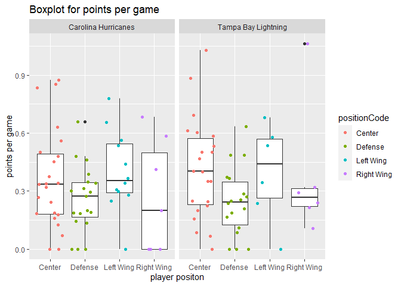

National Hockey League (NHL) Vignette
================
Maggie Feng
June 20, 2021

-   [Functions to read in the data](#functions-to-read-in-the-data)
    -   [NHL records API](#nhl-records-api)
    -   [NHL stats API](#nhl-stats-api)
    -   [API wrapper](#api-wrapper)
-   [Exploratory Data Analysis](#exploratory-data-analysis)
    -   [Contingency tables](#contingency-tables)
    -   [Bar plot](#bar-plot)
    -   [Numerical Summaries](#numerical-summaries)
    -   [Box plot](#box-plot)
    -   [Histogram](#histogram)
        -   [Points per game](#points-per-game)
        -   [Win Percent](#win-percent)
    -   [Scatter plot](#scatter-plot)

Required packages to run this vignette:

``` r
library(httr)
library(jsonlite)
library(tidyverse)
library(ggplot2)
library(knitr)
```

# Functions to read in the data

## NHL records API

The `getRecords` function will contact the [NHL records
API](https://gitlab.com/dword4/nhlapi/-/blob/master/records-api.md),
pull data from one of the six endpoints, and output a data frame.

The first argument `input` is to specify one of the six endpoints:

-   `"franchise"` will return id, firstSeasonId, lastSeasonId, and name
    of every team in the history of the NHL
-   `"teamtotal"` will return the total stats for every franchise
-   `"season"` will drill-down into season records and can do so for a
    specific franchise
-   `"goalie"` will return goalie records for all or a specified
    franchise
-   `"skater"` will return skater records for all or a specified
    franchise
-   `"history"` will return admin history and retired numbers

The arguments `name` and `id` are used to specify which team’s records
you wish to output. Adding `name` or `id` for the first two endpoints,
`"franchise"` and `"teamtotal"`, will have the same result of not adding
the arguments at all. For the third, fourth, and fifth endpoint `id`
specification is based on the `franchiseId`, while the sixth endpoint
`id` specification is based on the `mostRecentTeamId`. Due to possible
confusion surrounding the `id` input, if the `name` input is used
alongside it, `name` will override `id` when the function is run.

``` r
#Function to contact the NHL records API
getRecords <- function(input = c("franchise", "teamtotal", "season", "goalie", "skater", "history"), 
                       name = NULL, id = NULL){
  ##Note: if both team name and id arguments are filled, team name overrides id number
  
  #All queries are prefixed by this base_url
  base_url <- "https://records.nhl.com/site/api"
  
  #First two endpoints: do not have name/id specification
  if (input == "franchise" | input == "teamtotal"){
    if (input == "franchise")
      endpoint <- "franchise"
    if (input == "teamtotal")
      endpoint <- "franchise-team-totals"
    full_url <- paste0(base_url, "/", endpoint)
  }
  
  #Third, fourth, and fifth endpoints: with name/id specification by franchiseId
  if (input == "season" | input == "goalie" | input == "skater"){
    if (input == "season")
      endpoint <- "franchise-season-records"
    if (input == "goalie")
      endpoint <- "franchise-goalie-records"
    if (input == "skater")
      endpoint <- "franchise-skater-records"
    
    if (is.null(name) & is.null(id)){
      full_url <- paste0(base_url,"/", endpoint)
    }
    else {
      if (!is.null(id)) {
        full_url <- paste0(base_url,"/", endpoint, "?cayenneExp=franchiseId=", id)
      }
      if (!is.null(name)) {
        #Names based on franchiseId
        v <- c("Montreal Canadiens", "Montreal Wanderers", "St. Louis Eagles", "Hamilton Tigers",
               "Toronto Maple Leafs", "Boston Bruins", "Montreal Maroons", "Brooklyn Americans",
               "Philadelphia Quakers", "New York Rangers", "Chicago Blackhawks", "Detroit Red Wings",
               "Cleveland Barons", "Los Angeles Kings", "Dallas Stars", "Philadelphia Flyers", 
               "Pittsburgh Penguins", "St. Louis Blues", "Buffalo Sabres", "Vancouver Canucks", 
               "Calgary Flames", "New York Islanders", "New Jersey Devils", "Washington Capitals",
               "Edmonton Oilers", "Carolina Hurricanes", "Colorado Avalanche", "Arizona Coyotes",
               "San Jose Sharks", "Ottawa Senators", "Tampa Bay Lightning", "Anaheim Ducks",
               "Florida Panthers", "Nashville Predators", "Winnipeg Jets", "Columbus Blue Jackets",
               "Minnesota Wild", "Vegas Golden Knights", "Seattle Kraken")
        #Gives the number corresponding the position of the team name in vector v
        nameid <- match(name, v)
        full_url <- paste0(base_url,"/", endpoint,"?cayenneExp=franchiseId=", nameid)
      }
    }
  }
  
  #Sixth endpoint: has name/id specification by mostRecentTeamId instead of franchiseId
  if (input == "history"){
    endpoint <- "franchise-detail"
    if (is.null(name) & is.null(id)){
      full_url <- paste0(base_url, "/", endpoint)
    }
    else {
      if (!is.null(id)) {
        full_url <- paste0(base_url, "/", endpoint, "?cayenneExp=mostRecentTeamId=", id)
      }
      if (!is.null(name)) {
        #Names based on order of mostRecentTeamId
        u <- c("New Jersey Devils", "New York Islanders", "New York Rangers", "Philadelphia Flyers",
               "Pittsburgh Penguins", "Boston Bruins", "Buffalo Sabres", "Montreal Canadiens",
               "Ottawa Senators", "Toronto Maple Leafs", "Carolina Hurricanes", "Florida Panthers",
               "Tampa Bay Lightning", "Washington Capitals", "Chicago Blackhawks", 
               "Detroit Red Wings", "Nashville Predators", "St. Louis Blues", "Calgary Flames", 
               "Colorado Avalanche", "Edmonton Oilers", "Vancouver Canucks", "Anaheim Ducks", 
               "Dallas Stars","Los Angeles Kings", "San Jose Sharks", "Columbus Blue Jackets", 
               "Minnesota Wild", "Hamilton Tigers", "Philadelphia Quakers", "Montreal Wanderers",
               "Montreal Maroons","St. Louis Eagles", "Cleveland Barons", "Brooklyn Americans",
               "Winnipeg Jets", "Arizona Coyotes", "Vegas Golden Knights", "Seattle Kraken")
        #Gives the number corresponding the position of the team name in vector v
        nameid <- match(name, u)
        #Numbers corresponding to mostRecentTeamId for teams in vector u
        unum <- c(1:10, 12:30, seq(37,45,by=2), 49, 51:55)
        full_url <- paste0(base_url,"/", endpoint, "?cayenneExp=mostRecentTeamId=", unum[nameid])
      }
    }
  }
  x <- GET(full_url)           #Retrieving data from URL
  y <- content(x, as = "text") #Converiting it to JSON text
  z <- fromJSON(y)             #Converting to list
  #Returns well-formatted, parsed data
  as.data.frame(z$data)        #Converting to data frame
}
```

Below are some examples of how to use the function. The first outputs
all of the franchise information. The second shows how adding an `id`
(or `name`) argument will not affect the `"teamtotal"` (and
`"franchise"`) endpoint(s). The third shows season records for the team
with 1 as the`id`, which, in this case is the `franchiseId`. The fourth
shows season records for all teams since the `name` and `id` were not
specified. The fifth shows goalie information for the team with the
`name` Carolina Hurricanes. The sixth shows how the `name` input
overrides the `id` input, giving us the skater inforamtion for the team
with `name` Carolina Hurricanes. The seventh shows the admin history and
retired numbers for the team with 1 as the `id`, which is the
`mostRecentTeamId`. Do note that I reduced the number of columns in the
data frames in the `head` function so the output would be nicer.

``` r
## Examples:
#Franchise information
franchise <- getRecords("franchise")
head(franchise[,1:6])
```

    ##   id firstSeasonId            fullName lastSeasonId mostRecentTeamId teamAbbrev
    ## 1  1      19171918  Montréal Canadiens           NA                8        MTL
    ## 2  2      19171918  Montreal Wanderers     19171918               41        MWN
    ## 3  3      19171918    St. Louis Eagles     19341935               45        SLE
    ## 4  4      19191920     Hamilton Tigers     19241925               37        HAM
    ## 5  5      19171918 Toronto Maple Leafs           NA               10        TOR
    ## 6  6      19241925       Boston Bruins           NA                6        BOS

``` r
#Total stats for every franchise
total <- getRecords("teamtotal", id=1)
head(total[,1:6])
```

    ##   id activeFranchise firstSeasonId franchiseId gameTypeId gamesPlayed
    ## 1  1               1      19821983          23          2        2993
    ## 2  2               1      19821983          23          3         257
    ## 3  3               1      19721973          22          2        3788
    ## 4  4               1      19721973          22          3         310
    ## 5  5               1      19261927          10          2        6560
    ## 6  6               1      19261927          10          3         518

``` r
#Season records for specific franchise or for all 
season <- getRecords("season", id=1)
head(season[,c(1:4, 14)])
```

    ##   id fewestGoals fewestGoalsAgainst fewestGoalsAgainstSeasons franchiseId
    ## 1  8         155                131              1955-56 (70)           1

``` r
allseason <- getRecords("season")
head(allseason[,c(1:4,14)])
```

    ##   id fewestGoals fewestGoalsAgainst fewestGoalsAgainstSeasons franchiseId
    ## 1  1         174                164              2003-04 (82)          23
    ## 2  2         170                190              1975-76 (80)          22
    ## 3  3         150                177              1970-71 (78)          10
    ## 4  4         173                164              1973-74 (78)          16
    ## 5  5         182                188              1997-98 (82)          17
    ## 6  6         147                172              1952-53 (70)           6

``` r
#Goalie records for specific franchise
goalie <- getRecords("goalie", name = "Carolina Hurricanes")
head(goalie[,1:6])
```

    ##    id activePlayer firstName franchiseId       franchiseName gameTypeId
    ## 1 336        FALSE       Tom          26 Carolina Hurricanes          2
    ## 2 363        FALSE   Richard          26 Carolina Hurricanes          2
    ## 3 369        FALSE      Sean          26 Carolina Hurricanes          2
    ## 4 411        FALSE      Mark          26 Carolina Hurricanes          2
    ## 5 425        FALSE      John          26 Carolina Hurricanes          2
    ## 6 430        FALSE     Mario          26 Carolina Hurricanes          2

``` r
#Skater records for for specific franchise
skater <- getRecords("skater", name = "Carolina Hurricanes", id=1)
head(skater[,1:6])
```

    ##      id activePlayer assists firstName franchiseId       franchiseName
    ## 1 17239        FALSE       0       Jim          26 Carolina Hurricanes
    ## 2 17418        FALSE       1      Mike          26 Carolina Hurricanes
    ## 3 17543        FALSE       0      Fred          26 Carolina Hurricanes
    ## 4 17703        FALSE       2    Jergus          26 Carolina Hurricanes
    ## 5 17728        FALSE       0      Reid          26 Carolina Hurricanes
    ## 6 18169        FALSE       0       Bob          26 Carolina Hurricanes

``` r
#Admin history and retired numbers, Note: id is mostRecentTeamId
admin <- getRecords("history", id=1)
head(admin[,c(1,10,2,3)])
```

    ##   id mostRecentTeamId active
    ## 1 23                1   TRUE
    ##                                                                                                                                                                                                                                                                                                                                                                                                                                                                                                                                                                                                                                                                                                                                                                                                                                                                                                                                                                                                                                                                                                                                       captainHistory
    ## 1 <ul class="striped-list">\r\n\t<li>(No Captain) and Nico Hischier: 2020-21</li>\r\n\t<li>Andy Greene and (No Captain): 2019-20</li>\r\n\t<li>Andy Greene: 2015-16 &ndash;&nbsp;2018-19</li>\r\n\t<li>Bryce Salvador: 2012-13 &ndash;&nbsp;2014-15</li>\r\n\t<li>Zach Parise: 2011-12</li>\r\n\t<li>Jamie Langenbrunner: 2008-09 &ndash;&nbsp;2010-11</li>\r\n\t<li>Patrik Elias and Jamie Langenbrunner: 2007-08</li>\r\n\t<li>Patrik Elias: 2006-07</li>\r\n\t<li>(No Captain): 2005-06</li>\r\n\t<li>Scott Stevens and Scott Niedermayer: 2003-04</li>\r\n\t<li>Scott Stevens: 1992-93 &ndash;&nbsp;2002-03</li>\r\n\t<li>Bruce Driver: 1991-92</li>\r\n\t<li>Kirk Muller: 1987-88 &ndash;&nbsp;1990-91</li>\r\n\t<li>Mel Bridgman: 1984-85 &ndash;&nbsp;1986-87</li>\r\n\t<li>Don Lever and Mel Bridgman: 1983-84</li>\r\n\t<li>Don Lever: 1982-83</li>\r\n\t<li>Lanny McDonald and Rob Ramage: 1981-82</li>\r\n\t<li>Lanny McDonald: 1980-81</li>\r\n\t<li>Mike Christie, Rene Robert and Lanny McDonald: 1979-80</li>\r\n\t<li>Gary Croteau: 1978-79</li>\r\n\t<li>Wilf Paiement: 1977-78</li>\r\n\t<li>Simon Nolet: 1974-75 &ndash;&nbsp;1976-77</li>\r\n</ul>\r\n

## NHL stats API

The `getStats` function will contact the [NHL stats
API](https://gitlab.com/dword4/nhlapi/-/blob/master/stats-api.md) for
the modifier and will output a data frame for a specified team or all
teams. The arguments `id` and `name` can be specified if we want to look
at a specific team. Otherwise, we can leave the arguments empty to
output all teams stats. The function will output an error if the `id` or
`name` corresponds to the team Seattle Kraken, because there is no stats
data for this team. With a bit of research, the lack of stats may be
because the Seattle Kraken is a new team that joined in 2021, so there
is no data on them currently.

``` r
getStats <- function(name = NULL, id = NULL){
  base_url <- "https://statsapi.web.nhl.com/api/v1/teams"
  
  #function to get the data into a useable form
  getData <- function(url){
    x <- GET(full_url)
    y <- content(x, as = "text")
    fromJSON(y)
  }
  
  if (is.null(name) & is.null(id)){
      full_url <- paste0(base_url, "?expand=team.stats")
      z <- getData(full_url)
      df <- NULL
      for (i in 1:31){
        #selecting stats
        a <- z$teams[i,]$teamStats[[1]]$splits[[1]]$stat[1,]
        #id and names for the teams
        b <- z$teams[i,][,c("id","name")]
        #combining the two
        c <- cbind(b,a)
        #adding the new row to the data frame
        df <- rbind(df,c)
      }
      df
    }
    else {
      if (!is.null(id)) {
        if (id == 55){
          stop("Seattle Kraken is a new team in the NHL (as of 2021), 
               so there is no data on them")
        }
        full_url <- paste0(base_url, "/", id, "?expand=team.stats")
      }
      if (!is.null(name)) {
        #Based on id which corresponds to `mostRecentTeamId` in previous function
        #but has less teams than previous function
        u <- c("New Jersey Devils", "New York Islanders", "New York Rangers", "Philadelphia Flyers",
               "Pittsburgh Penguins", "Boston Bruins", "Buffalo Sabres", "Montreal Canadiens",
               "Ottawa Senators", "Toronto Maple Leafs", "Carolina Hurricanes", "Florida Panthers",
               "Tampa Bay Lightning", "Washington Capitals", "Chicago Blackhawks", 
               "Detroit Red Wings", "Nashville Predators", "St. Louis Blues", "Calgary Flames", 
               "Colorado Avalanche", "Edmonton Oilers", "Vancouver Canucks", "Anaheim Ducks", 
               "Dallas Stars", "Los Angeles Kings", "San Jose Sharks", "Columbus Blue Jackets", 
               "Minnesota Wild", "Winnipeg Jets", "Arizona Coyotes", "Vegas Golden Knights",
               "Seattle Kraken")
        nameid <- match(name, u)
        #Id number corresponding to team names above
        unum <- c(1:10, 12:26, 28:30, 52:55)
        if (unum[nameid] == 55){
          stop("Seattle Kraken is a new team in the NHL (as of 2021), 
               so there is no data on them")
        }
        full_url <- paste0(base_url, "/", unum[nameid], "?expand=team.stats")
      }
      z <- getData(full_url)
      #selecting stats
      a <- z$teams[1,]$teamStats[[1]]$splits[[1]]$stat[1,]
      #id and names for the teams
      b <- z$teams[1,][,c("id","name")]
      #combining the two
      cbind(b,a)
    }
}
```

Below are examples of calling the `getStats` function. The first example
calls all teams. The second calls the team with 1 as the `id`. The third
calls for teh team named Carolina Hurricanes. The fourth calls for the
team named Seattle Kraken, which will output an error since they are a
new team in the NHL (as of 2021), so there is currently no data on them
in the API.

``` r
## Examples
#All stats for all teams
all <- getStats()
head(all[,1:9])
```

    ##   id                name gamesPlayed wins losses ot pts ptPctg goalsPerGame
    ## 1  1   New Jersey Devils          56   19     30  7  45   40.2        2.589
    ## 2  2  New York Islanders          56   32     17  7  71   63.4        2.714
    ## 3  3    New York Rangers          56   27     23  6  60   53.6        3.143
    ## 4  4 Philadelphia Flyers          56   25     23  8  58   51.8        2.857
    ## 5  5 Pittsburgh Penguins          56   37     16  3  77   68.8        3.446
    ## 6  6       Boston Bruins          56   33     16  7  73   65.2        2.929

``` r
#For a specific team
team1 <- getStats(id = 1)
head(team1[,1:9])
```

    ##   id              name gamesPlayed wins losses ot pts ptPctg goalsPerGame
    ## 1  1 New Jersey Devils          56   19     30  7  45   40.2        2.589

``` r
team2 <- getStats(name = "Carolina Hurricanes")
head(team2[,1:9])
```

    ##   id                name gamesPlayed wins losses ot pts ptPctg goalsPerGame
    ## 1 12 Carolina Hurricanes          56   36     12  8  80   71.4        3.125

``` r
#For Seattle Kraken (recentId = 55)
getStats(name = "Seattle Kraken")
```

    ## Error in getStats(name = "Seattle Kraken"): Seattle Kraken is a new team in the NHL (as of 2021), 
    ##                so there is no data on them

## API wrapper

The `getEndpoint` function is a wrapper function that allows the user to
access any of the six API endpoints of `getRecords` or the stats from
`getStats` including the modification for selecting the team using
`name` or `id`. The `input` argument takes the six choices from
`getRecords` and a new choice `"stats"`, which will output `getStats`
for all or a specified team.

``` r
getEndpoint <- function(input, name = NULL, id = NULL){
  if (input == "stats"){
    getStats(name, id)
  }
  else {
    getRecords(input, name, id)
  }
}
```

# Exploratory Data Analysis

The data appears to be from over a year ago, but I decided to focus on
the skaters and goalies that were considered active. For some of the
graphs I chose to compare the Carolina Hurricanes and Tampa Bay
Lightning. I selected these two teams because the Carolina Hurricanes
are the home team of North Carolina and the Tampa Bay Lightning were the
2020 Stanley Cup winners and the team that recently beat the Hurricanes
for the semifinal spot for the 2021 Stanley Cup. For other graphs I
focused on the Carolina Hurricanes or all players in a specfied
position.

To get the data we are interested in, we can use the `getEndpoint`
function. I began by pulling the data from the teams Tampa Bay Lightning
and Carolina Hurricanes, combined the two datasets, filtered and
selected by our variables of interest, and created new variables. This
was done for both the skaters and goalies of each team. The data on the
skaters and goalies were combined to examine the composition of the team
rosters. Finally, a dataset containing all active goalies in the league
was created to see how well the goalies perform.

New variables of interest: \* For skaters: + `ppg` or points per game
which is to determine their average points in the number of games they
have played \* For goalies: + `winPercent` which follows the formula
given in [this](http://hockeygoalies.org/stats/glossary.html) website +
`positionCode` to match the column that the skaters have

``` r
##Each team's skaters:
#Tampa Bay Lightning
skateLightning <- getEndpoint("skater", name = "Tampa Bay Lightning")
#Carolina Hurricanes
skateHurricane <- getEndpoint("skater", name = "Carolina Hurricanes")

#Combining the datasets, choosing only active players, and variables of interest
#New variable: ppg
skateTBLvsCH <- rbind(skateLightning, skateHurricane) %>% 
  filter(activePlayer == TRUE) %>%
  select(franchiseName, playerId, positionCode, gamesPlayed, assists, goals, points, 
         penaltyMinutes) %>% 
  mutate(ppg = points/gamesPlayed)

#Converting the variables to factors and labeling levels
skateTBLvsCH$positionCode <- factor(skateTBLvsCH$positionCode, 
                                     c("C", "D", "L", "R"), 
                                     c("Center", "Defense", "Left Wing", "Right Wing"))

##Each team's goalies:
#Tampa Bay Lightning
goalLightning <- getEndpoint("goalie", name = "Tampa Bay Lightning")
#Carolina Hurricanes
goalHurricane <- getEndpoint("goalie", name = "Carolina Hurricanes")

#Combining the datasets, choosing only active players, and variables of interest
#New variable: winPercent and positionCode
goalTBLvsCH <- rbind(goalLightning, goalHurricane) %>% 
  filter(activePlayer == TRUE) %>%
  select(franchiseName, playerId, gamesPlayed, losses, wins, ties, overtimeLosses, shutouts) %>%
  replace_na(list(ties = 0)) %>% 
  mutate(winPercent = ((2*wins)+ ties + overtimeLosses)/(2*(wins + losses + ties + overtimeLosses)), 
         positionCode = "Goalie")

#All players on the two teams - essentially like a roster
skateroster <- skateTBLvsCH %>% select(franchiseName, playerId, positionCode, gamesPlayed)
goalroster <- goalTBLvsCH %>% select(franchiseName, playerId, positionCode, gamesPlayed)
rosterTBLvsCH <- rbind(skateroster, goalroster)

#All active goalies in the NHL with variables of interest and new variable winPercent
allGoalie <- getEndpoint(input = "goalie") %>% 
  filter(activePlayer == TRUE) %>%
  select(franchiseName, playerId, gamesPlayed, losses, wins, ties, overtimeLosses, shutouts) %>%
  mutate(winPercent=((2*wins)+ ties + overtimeLosses)/(2*(wins + losses + ties + overtimeLosses))) %>%
  replace_na(list(ties = 0, overTimeLosses = 0, winPercent = 0))
```

## Contingency tables

The following table and barplot display the active players by their
positions in their respective teams. We can see that the Carolina
Hurricanes had more players on their team since they have more centers,
defense, and left wing and the same number of goalies and right wing as
the Tampa Bay Lightning.

``` r
#Table for franchiseName by positionCode
kable(table(rosterTBLvsCH$franchiseName, rosterTBLvsCH$positionCode),
             caption = "Players in each team by position information")
```

|                     | Center | Defense | Left Wing | Right Wing | Goalie |
|:--------------------|-------:|--------:|----------:|-----------:|-------:|
| Carolina Hurricanes |     23 |      19 |        12 |          7 |      5 |
| Tampa Bay Lightning |     22 |      18 |         6 |          6 |      5 |

Players in each team by position information

## Bar plot

The bar plot below visually displays the data from the table above.

``` r
ggplot(rosterTBLvsCH, aes(positionCode, fill = franchiseName)) + 
  geom_bar(position = "dodge") +
  labs(title = "Players of each team by position", x = "Position")
```

<!-- -->

## Numerical Summaries

Suppose we want to get a preliminary investigation on the data for
skaters, by team or for all skaters with a specific position. The
`getSkaterSummary` function will take in the team and position for
active skaters that we are interested in and outputs a the five number
summary for the assists, goals, points, and penalty Minutes.

``` r
getSkaterSummary <- function(position, name = NULL){
  skatePosition <- getEndpoint("skater", name)
  new <- skatePosition %>% filter(activePlayer == TRUE & positionCode == position) %>%
    select(assists, goals, points, penaltyMinutes)
  if (position == "C")
     type = "Center"
  if (position == "D")
     type = "Defense"
  if (position == "L")
     type = "Left Wing"
  if (position == "R")
     type = "Right Wing"
  if (is.null(name)){
    main <- paste0("Summary of ", type)
  }
  else {
    main <- paste0("Summary of ", type, " for ", name)
  }
  kable(apply(new, 2, summary), caption = main)
}
```

When we look at the data for players on the Carolina Hurricanes we can
see that the minimum assists, goals, points, and penalty minutes is
usually zero across all positions, except left wing players that have
four minutes as the minimum penalty minutes. The left wing players also
have a larger value for the first quartile for all variables. The right
wing players have small values for the first quartile and median, but as
we saw from the bar graph, we know there are fewer left wing players
than the other three positions (center, denfense, and left wing). An
interesting observation, is the defense (defencemen) for the Carolina
Hurricanes has more assists and points than the right wing, on average.
The centers also have the largest maximum values for all four variables.

``` r
getSkaterSummary(position = "C", name = "Carolina Hurricanes")
```

|         | assists |     goals |   points | penaltyMinutes |
|:--------|--------:|----------:|---------:|---------------:|
| Min.    |     0.0 |   0.00000 |   0.0000 |        0.00000 |
| 1st Qu. |     4.5 |   2.50000 |   7.5000 |        8.00000 |
| Median  |    27.0 |  19.00000 |  45.0000 |       35.00000 |
| Mean    |    61.0 |  42.17391 | 103.1739 |       75.43478 |
| 3rd Qu. |    52.0 |  42.00000 |  94.0000 |       70.50000 |
| Max.    |   453.0 | 322.00000 | 775.0000 |      678.00000 |

Summary of Center for Carolina Hurricanes

``` r
getSkaterSummary(position = "D", name = "Carolina Hurricanes")
```

|         |   assists |    goals |    points | penaltyMinutes |
|:--------|----------:|---------:|----------:|---------------:|
| Min.    |   0.00000 |  0.00000 |   0.00000 |        0.00000 |
| 1st Qu. |   4.50000 |  0.50000 |   4.50000 |        9.50000 |
| Median  |  13.00000 |  4.00000 |  20.00000 |       30.00000 |
| Mean    |  38.78947 | 12.84211 |  51.63158 |       50.15789 |
| 3rd Qu. |  57.50000 | 15.50000 |  73.00000 |       64.50000 |
| Max.    | 173.00000 | 85.00000 | 258.00000 |      265.00000 |

Summary of Defense for Carolina Hurricanes

``` r
getSkaterSummary(position = "L", name = "Carolina Hurricanes")
```

|         | assists |  goals | points | penaltyMinutes |
|:--------|--------:|-------:|-------:|---------------:|
| Min.    |    0.00 |   0.00 |   0.00 |        4.00000 |
| 1st Qu. |   19.75 |  11.50 |  30.25 |       29.00000 |
| Median  |   25.50 |  19.00 |  45.50 |       58.00000 |
| Mean    |   48.50 |  39.25 |  87.75 |       68.66667 |
| 3rd Qu. |   38.50 |  39.00 |  77.50 |       81.00000 |
| Max.    |  181.00 | 204.00 | 379.00 |      268.00000 |

Summary of Left Wing for Carolina Hurricanes

``` r
getSkaterSummary(position = "R", name = "Carolina Hurricanes")
```

|         |  assists |    goals |    points | penaltyMinutes |
|:--------|---------:|---------:|----------:|---------------:|
| Min.    |  0.00000 |  0.00000 |   0.00000 |        0.00000 |
| 1st Qu. |  0.00000 |  0.00000 |   0.00000 |        0.00000 |
| Median  |  1.00000 |  0.00000 |   1.00000 |        6.00000 |
| Mean    | 20.42857 | 15.71429 |  36.14286 |       38.71429 |
| 3rd Qu. | 30.50000 | 25.50000 |  56.00000 |       52.50000 |
| Max.    | 81.00000 | 59.00000 | 140.00000 |      160.00000 |

Summary of Right Wing for Carolina Hurricanes

## Box plot

If we were interested in seeing the points per game of the skaters. The
players with positions center, defense, and left wing have similar plots
between the two teams. Some slight differences is the center on the
Tampa Bay Lightnings with over 0.9 points per game. On the Carolina
Hurricanes, the defense player with over 0.6 points per game is an
outlier, but for Tampa Bay, the player with over 0.6 points per game is
still within the whisker of the boxplot. The most noticable difference
between the two teams are in the right wing boxplot. First the inter
quartile range for the Tampa Bay Lightning is much smaller than the
Carolina Hurricanes and they also have an outlier that is over 0.9
points per game.

``` r
ggplot(skateTBLvsCH, aes(positionCode, ppg)) +
  geom_boxplot() +
  geom_jitter(aes(color = positionCode)) + 
  facet_wrap(~franchiseName) +
  labs(title = "Boxplot for points per game", x = "player positon", y = "points per game")
```

<!-- -->

## Histogram

### Points per game

Using a historgram we can roughly see what the density of the player’s
points per game for each team. The two teams have similar density lines,
with a slightly right skewed shape. We can also see Tampa Bay Lighting
has players who score at least one point per game they play, while the
Carolina Hurricanes all stay below one point per game.

``` r
#Separated histograms for each team
ggplot(skateTBLvsCH, aes(ppg)) +
  geom_histogram(aes(y = ..density..), bins = 15) + 
  geom_density(color = "red") +
  facet_wrap(~franchiseName) +
  labs(title = "Histogram for points per game by team", x = "Points per game")
```

<!-- -->

### Win Percent

From the histogram of win percent for all goalies in the NHL, we can see
many stay are close to zero, which logically makes sense. For example,
the Carolina Hurricanes and Tampa Bay Lightning had five goalies.
Assuming they have two to three main goalies then many of the goalies
would not have many opportunities to play and therefore have a zero win
percentage. If we ignore the zero percent win rate, then the data from
around 0.3 to 0.6 contain the majority of win percentages and few
goalies are above/below that range.

``` r
#A histogram for all goalies in the NHL
ggplot(allGoalie, aes(winPercent)) +
  geom_histogram(aes(y = ..density..), bins = 15) +
  labs(title = "Histogram for Win Percent of All Goalies in NHL", x = "Win Percent")
```

<!-- -->

## Scatter plot

Looking at the scatterplots for the number of games played versus the
points per game, we can see that there is generally a positive trend for
both teams. This makes sense since there is more opportunity to obtain
points by playing in more games.

``` r
ggplot(skateTBLvsCH, aes(gamesPlayed, points, col = franchiseName)) + 
  geom_point() + 
  labs(title = "Games Played vs Points", x = "Games Played", y = "Points")
```

<!-- -->
